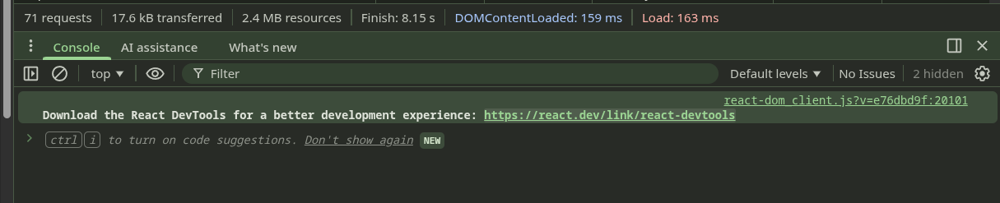

# React

* React is a powerful, open-source JavaScript library developed by Meta, designed for building dynamic, interactive user interfaces and single-page applications (SPAs).
* Built with a component-based architecture, React promotes modularity, reusability, and maintainability through encapsulated components that manage their own state.
* React 19, released in April 2024, introduces revolutionary features like Server Components, Actions, and enhanced concurrent rendering, making it the most powerful version yet for modern web development.

## Key Features

* **Component-Based Architecture**: Build encapsulated, reusable UI components that manage their own state and compose to create complex interfaces.
* **Virtual DOM**: Uses a virtual representation of the DOM for efficient updates and rendering, improving performance.
  * **What is the Virtual DOM?**: A JavaScript representation of the real DOM kept in memory. It's a lightweight copy of the actual DOM elements stored as JavaScript objects.
  * **How it Works**: When state changes occur, React creates a new virtual DOM tree representing the new state, then compares (diffs) it with the previous virtual DOM tree to identify what actually changed.
  * **Reconciliation Process**: React's diffing algorithm efficiently determines the minimum number of changes needed to update the real DOM, then applies only those specific changes.
  * **Performance Benefits**: Direct DOM manipulation is expensive because it triggers layout recalculations and repaints. The Virtual DOM minimizes these operations by batching updates and only touching the real DOM when necessary.
  * **Example**: If you update one item in a list of 1000 items, React will only update that single DOM element rather than re-rendering the entire list.
  * **Memory Trade-off**: Uses more memory to store the virtual representation, but this is typically insignificant compared to the performance gains from reduced DOM operations.
* **JSX Syntax**: Write HTML-like syntax within JavaScript, making component templates intuitive and readable.
* **Unidirectional Data Flow**: Data flows down from parent to child components, making applications predictable and easier to debug.
* **Hooks**: Modern functional approach to state management and lifecycle methods without class components.
* **Server Components**: Run components on the server for better performance and SEO.
* **Actions**: Built-in support for handling form submissions and data mutations.
* **Enhanced Concurrent Features**: Improved Suspense, automatic batching, and better error boundaries.
* **React Developer Tools**: Browser extensions for debugging and inspecting React component trees.
* **Rich Ecosystem**: Vast collection of third-party libraries, tools, and community resources.
* **Cross-Platform Development**: Build web apps, mobile apps (React Native), and desktop apps (Electron) with shared knowledge.

## Why Use React?

* **Developer Experience**: Excellent tooling, hot reloading, and debugging capabilities enhance productivity.
* **Performance**: Virtual DOM, Server Components, and enhanced concurrent features ensure fast, responsive user interfaces.
* **Flexibility**: Library approach allows choosing the best tools for routing, state management, and other concerns.
* **Community**: Large, active community with extensive documentation, tutorials, and third-party packages.
* **Industry Adoption**: Used by major companies like Meta, Netflix, Airbnb, and thousands of others.
* **Learning Path**: Skills transfer well to React Native for mobile development.

## Resources

* **Official React Website**: Comprehensive documentation, tutorials, and community resources.
  * (<https://react.dev>)
* **Official Documentation**: Detailed guides, API references, and best practices.
  * (<https://react.dev/learn>)
* **React Blog**: Latest news, release notes, and updates.
  * (<https://react.dev/blog>)
* **Interactive Tutorial**: Learn React step-by-step with hands-on examples.
  * (<https://react.dev/learn/tutorial-tic-tac-toe>)
  * Highly recommended

## Getting Started

* Install Node.js (version 18 or higher required for React 19)
  * React 19 requires Node.js 18+ for development tooling and package management.
  * Download from: <https://nodejs.org>

* Create a new React project using Create React App (CRA):
  * CRA is the traditional, official tool from Facebook/Meta for bootstrapping React applications.

  ```bash
  npx create-react-app my-react-app
  cd my-react-app
  npm start
  ```

* Alternative: Create a new React project with Vite (faster build tool):
  * Vite is a modern, fast build tool created by Evan You (Vue.js creator)

  ```bash
  npm create vite@latest my-react-app -- --template react
  cd my-react-app
  npm install
  npm run dev
  ```

### Key Differences Summary

| Feature | Create React App | Vite |
|---------|------------------|------|
| **Speed** | Slower | Much faster |
| **Bundle Size** | Larger | Smaller |
| **Configuration** | Limited (requires ejecting) | Highly flexible |
| **TypeScript** | Additional setup needed | Built-in support |
| **Hot Reload** | Slower | Near-instant |
| **Modern Standards** | Older approach | Modern, cutting-edge |
| **Learning Curve** | Easier for beginners | Slightly steeper but worth it |
| **Maintenance** | Reduced active development | Active development |

* For new projects in 2024/2025, Vite is generally the better choice because:
  * Significantly faster development experience
  * Better performance and smaller bundles
  * More modern tooling and better TypeScript support
  * Active development and growing ecosystem
  * Easy migration path if needed

>Class Note: Demo creating a new app using both options and exploring the file structure.

## File Structure

### Create React App Structure

| **Location**              | **File/Directory**    | **Description**                                                                 |
| ------------------------- | --------------------- | ------------------------------------------------------------------------------- |
| `/my-react-app/`          | `package.json`        | Project metadata, dependencies, and npm scripts configuration.                  |
| `/my-react-app/`          | `package-lock.json`   | Locks exact versions of dependencies for consistent installs.                   |
| `/my-react-app/`          | `README.md`           | Project documentation with setup and usage instructions.                       |
| `/my-react-app/`          | `.gitignore`          | Specifies files and directories Git should ignore.                             |
| `/my-react-app/`          | `node_modules/`       | Contains all npm dependencies installed for the project.                        |
| `/my-react-app/public/`   | `public/`             | Static assets served directly by the web server.                               |
| `/my-react-app/public/`   | `index.html`          | Main HTML file with root div where React app mounts.                          |
| `/my-react-app/public/`   | `favicon.ico`         | Website icon displayed in browser tabs.                                        |
| `/my-react-app/src/`      | `src/`                | Source code directory containing all React components and assets.               |
| `/my-react-app/src/`      | `index.js`            | Entry point that renders the App component into the DOM.                       |
| `/my-react-app/src/`      | `App.js`              | Main application component containing the app's root structure.                 |
| `/my-react-app/src/`      | `App.css`             | Styles for the main App component.                                              |
| `/my-react-app/src/`      | `index.css`           | Global styles applied to the entire application.                                |
| `/my-react-app/src/`      | `App.test.js`         | Unit tests for the App component using Jest testing framework.                  |

### Vite Structure

| **Location**              | **File/Directory**    | **Description**                                                                 |
| ------------------------- | --------------------- | ------------------------------------------------------------------------------- |
| `/my-react-app/`          | `package.json`        | Project metadata, dependencies, and npm scripts configuration.                  |
| `/my-react-app/`          | `package-lock.json`   | Locks exact versions of dependencies for consistent installs.                   |
| `/my-react-app/`          | `vite.config.js`      | Vite configuration file for build settings and plugins.                        |
| `/my-react-app/`          | `README.md`           | Project documentation with setup and usage instructions.                       |
| `/my-react-app/`          | `.gitignore`          | Specifies files and directories Git should ignore.                             |
| `/my-react-app/`          | `node_modules/`       | Contains all npm dependencies installed for the project.                        |
| `/my-react-app/`          | `index.html`          | Main HTML file (in root, not public/) with root div where React app mounts.   |
| `/my-react-app/public/`   | `public/`             | Static assets served directly by the web server.                               |
| `/my-react-app/public/`   | `vite.svg`            | Vite logo used in the default template.                                        |
| `/my-react-app/src/`      | `src/`                | Source code directory containing all React components and assets.               |
| `/my-react-app/src/`      | `main.jsx`            | Entry point that renders the App component into the DOM (JSX extension).       |
| `/my-react-app/src/`      | `App.jsx`             | Main application component containing the app's root structure (JSX extension). |
| `/my-react-app/src/`      | `App.css`             | Styles for the main App component.                                              |
| `/my-react-app/src/`      | `index.css`           | Global styles applied to the entire application.                                |
| `/my-react-app/src/assets/` | `assets/`           | Directory for static assets like images, fonts, etc.                           |
| `/my-react-app/src/assets/` | `react.svg`         | React logo used in the default template.                                       |

### Key Structural Differences

* **HTML Location**: CRA keeps `index.html` in `public/`, Vite keeps it in the root directory
* **File Extensions**: Vite uses `.jsx` extensions by default, CRA uses `.js`
* **Entry Point**: CRA uses `index.js`, Vite uses `main.jsx`
* **Configuration**: CRA has no config file (requires ejecting), Vite has `vite.config.js`
* **Assets**: Vite includes a dedicated `src/assets/` directory

## Our Demo Application

```bash
cd [YOUR_FOLDER]/codando-live/_12_React/

# Creating a react app called react-demo-app
npm create vite@latest react-demo-app -- --template react

# Running the app in development mode
cd react-demo-app
npm run dev
```

### Structural elements

| File | Description |
| --- | --- |
| `index.html` | The static HTML shell. Vite serves this and the `<script type="module" src="/src/main.jsx">` loads your app. Contains the DOM mount node (e.g. `<div id="root"></div>`). |
| `src/main.jsx` | Entry module. Imports React, ReactDOM and your root component, then mounts it into the DOM node from `index.html`. |
| `src/App.jsx` | Root React component (default export). Composes the app UI and child components. |

## Components

* A [**component**](https://react.dev/learn/your-first-component) is the fundamental building block of React applications.
* Components are reusable, self-contained pieces of UI that encapsulate their structure, behavior, and styling.
* They represent parts of the user interface and can be composed together to build complex applications.

### Key Characteristics of Components

* **Encapsulation**: Each component manages its own state, props, and rendering logic.
* **Reusability**: Components can be used multiple times throughout the application.
* **Composition**: Components can contain other components, creating a component tree.
* **Props**: Components receive data from parent components through properties (props).
* **State**: Components can manage their own internal state for dynamic behavior.

### Types of Components

#### 1. Functional Components (Modern Approach)

* Functional components are JavaScript functions that return JSX.
* They use React Hooks for state and lifecycle management.

```jsx
import React from 'react';

function HelloWorld() {
  return (
    <div>
      <h2>Welcome to Our React App!</h2>
      <p>Hello React World!</p>
    </div>
  );
}

export default HelloWorld;
```

>Warning: React components are regular JavaScript functions, but their names must start with a capital letter or they won’t work!

#### 2. Class Components (Legacy Approach)

* Class components extend React.Component and use lifecycle methods.
* While still supported, functional components with hooks are preferred.

```jsx
import React, { Component } from 'react';

class HelloWorldClass extends Component {
  render() {
    return (
      <div>
        <h2>Welcome to Our React App!</h2>
        <p>Hello React World!</p>
      </div>
    );
  }
}

export default HelloWorldClass;
```

### Creating Your First Functional Component

* Create a file called `HelloWorld.jsx` inside the `components` folder
* Paste the content below

  ```jsx
  import React from 'react';

  function HelloWorld() {
    return (
      <div>
        <h2>Welcome to Our React App!</h2>
        <p>Hello React World!</p>
      </div>
    );
  }

  export default HelloWorld;
  ```

* Import the new componet in the App.jsx
  * `import HelloWorld from './components/HelloWorld'`
* Add the new component to the App.jsx body
  * `<HelloWorld /> {/* render the new component without breaking existing layout */}`

* App.jsx after the changes

  ```jsx
  import { useState } from 'react'
  import './App.css'

  import HelloWorld from './components/HelloWorld'

  function App() {

    return (
      <>
        <HelloWorld />
      </>
    )
  }

  export default App
  ```

### Functional component content
- Component function
  - Must start with a capital letter (e.g. `HelloWorld`).
  - Accepts `props` (e.g. `function HelloWorld({ name }) { ... }`).
- Local state and hooks
  - `const [state, setState] = useState(initial)` and other hooks.
- Event handlers and helper functions
  - Defined inside the component so they can access props/state.
- Return (JSX)
  - The function returns JSX. This is the UI the component renders.
- Export
  - `export default HelloWorld` or named export.

#### Props
Props (properties) are the read-only inputs a parent component passes to a child. They configure and customize a component's behavior and appearance without the child modifying them. Props are received as a single object argument (often destructured) and enable composition and reuse by decoupling data from implementation.

#### useState

`useState` is a hook that gives a component its own local piece of data (state) and a setter to update it.

#### useEffect

`useEffect` is the hook for running side effects after a component renders. Side effects are interactions with the outside world (network requests, subscriptions, timers, or manual DOM updates).

#### Example:

* MonthsDropDown component

```css
/* Basic styles for the MonthsDropdown component */
select {
  padding: 6px 10px;
  font-size: 14px;
  border: 1px solid #ccc;
  border-radius: 4px;
  background: #fff;
  color: #111;
  appearance: none;
  /* remove native arrow in some browsers */
}

select:focus {
  outline: none;
  box-shadow: 0 0 0 3px rgba(21, 156, 228, 0.15);
  border-color: #159ce4;
}

/* optional small responsive tweak */
@media (max-width: 480px) {
  select {
    width: 100%;
    font-size: 16px;
  }
}
```

```jsx
import { useState } from 'react';
import './MonthsDropdown.css'; // <-- import the CSS file

function MonthsDropdown({ value = '', onChange }) {
  // Props:
  // - value: initial / controlled selected month (string)
  // - onChange: callback invoked when the user selects a month

  // Local constant array of month names.
  const months = [
    'January', 'February', 'March', 'April', 'May', 'June',
    'July', 'August', 'September', 'October', 'November', 'December'
  ];

  // Hooks:
  // useState -> local state for the currently selected month
  const [month, setMonth] = useState(value);

  // handleMonthChange uses the useState setter to update local state
  // and calls the onChange prop to notify the parent of the new selection
  function handleMonthChange(e) {
    const selectedMonth = e.target.value;
    setMonth(selectedMonth); // updates local state (useState)
    onChange(selectedMonth); // notifies parent (prop)
  }

  return (
    <select value={month} onChange={handleMonthChange} >
      <option value="">Select month</option>
      {
        months.map((m) => (
          <option key={m} value={m}>{m}</option>
        ))
      }
    </select>
  );
}

export default MonthsDropdown;
```

* App.jsx

```jsx
import { useState } from 'react' // Hook: useState for local component state
import './App.css'

import HelloWorld from './components/HelloWorld'
import MonthsDropdown from './components/MonthsDropdown' // Child component that uses props and hooks

function App() {

  // useState: parent keeps the currently selected month
  // - month: current value
  // - setMonth: setter passed down to child so it can notify the parent
  const [month1, setMonth1] = useState('')

  const [month2, setMonth2] = useState('')

  return (
    <>
      {/* <HelloWorld /> */}
      <label>
        Choose month 1:{' '}
        {
          /* Props:
            - value: current selected month (from parent state)
            - onChange: callback the child calls with the new month
          */
        }
        <MonthsDropdown value={month1} onChange={setMonth1} />
        <MonthsDropdown value={month2} onChange={setMonth2} />
      </label>

      <p>Selected months: {month1} - {month2}</p>
    </>
  )
}

export default App
```

---

## JSX (JavaScript XML)

* [JSX](https://react.dev/learn/writing-markup-with-jsx) is a syntax extension for JavaScript that allows you to write HTML-like code within JavaScript.
* It makes React components more readable and intuitive by combining the power of JavaScript with the familiarity of HTML.
* JSX is transpiled to regular JavaScript function calls by tools like Babel.

>Note: [Great JSX Tutorial from W3 School](https://www.w3schools.com/react/react_jsx.asp)

### JSX Rules

1. **Return a single root element**: Components must return a single parent element or React Fragment.
2. **Close all tags**: All HTML tags must be properly closed, including self-closing tags.
3. **Use camelCase for attributes**: HTML attributes use camelCase (e.g., `className` instead of `class`).
4. **JavaScript expressions in curly braces**: Use `{}` to embed JavaScript expressions.

####  Why do multiple JSX tags need to be wrapped?

* JSX looks like HTML, but under the hood it is transformed into plain JavaScript objects. 
* You can’t return two objects from a function without wrapping them into an array.
* This explains why you also can’t return two JSX tags without wrapping them into another tag or a Fragment.

#### Why use camelCase

* JSX turns into JavaScript and attributes written in JSX become keys of JavaScript objects.
* In your own components, you will often want to read those attributes into variables.
* But JavaScript has limitations on variable names. 
* For example, their names can’t contain dashes or be reserved words like class.
* This is why, in React, many HTML and SVG attributes are written in camelCase. 
* For example, instead of stroke-width you use strokeWidth. 
* Since class is a reserved word, in React you write className instead

### Basic JSX Examples

```jsx
// Valid JSX - Single root element.
// Returning a div
function MyComponent() {
  return (
    <div>
      <h1>Hello World</h1>
      <p>This is a paragraph</p>
    </div>
  );
}

// Valid JSX - React Fragment
// Returning two paragraphs inside <> </>
function MyComponent() {
  return (
    <>
      <h1>Hello World</h1>
      <p>This is a paragraph</p>
    </>
  );
}

// JavaScript expressions in JSX
function Greeting({ name }) {
  const currentTime = new Date().toLocaleTimeString();
  
  return (
    <div>
      <h1>Hello, {name}!</h1>
      <p>Current time: {currentTime}</p>
      <p>Random number: {Math.floor(Math.random() * 100)}</p>
    </div>
  );
}
```

### Combining JSX and JavaScript (common patterns)

Below are the most common patterns when you mix JavaScript and JSX. The repo includes small example components under `react-demo-app/src/components` that demonstrate each pattern — the code snippets below match those components so you can copy/paste them easily.

* 1. Comments
* 2. Store JSX in variables
* 3. Dynamic CSS Styles
* 4. Embed expressions
* 5. Conditional rendering
* 6. Render lists
* 7. Functions that return JSX
* 8. Props (Properties)
* 9. Event handlers
* 10. Controlled Components
* 11. Dynamic attributes
* 12. Spread props

#### 1. Comments

Use normal JS comments in logic, and {/* ... */} inside JSX.

Example (component: `ExampleComments.jsx`):

```jsx
import React from 'react';

export default function ExampleComments() {
  // JS comment above
  const count = 3;

  return (
    <div>
      {/* JSX comment: explains the header */}
      <h1>Inbox</h1>

      {/* Multi-line JSX comment:
          - documents group intent
      */}
      <ul>
        <li>Message 1</li>
        <li>Message 2</li>
      </ul>

      {/* Commenting out an element */}
      {/* <LegacyBadge /> */}

      {process.env.NODE_ENV === 'development' && (
        <small>Dev mode — debug info visible</small>
      )}
      <div>Count example: {count}</div>
    </div>
  );
}
```

#### 2. Store JSX in variables

Short: put reusable fragments into constants for clarity.

Example (component: `SimpleLayout.jsx`):

```jsx
const header = <h1>My Static Header</h1>;
const content = (
  <div>
    <ul>
      <li>Apples</li>
      <li>Bananas</li>
      <li>Cherries</li>
    </ul>
  </div>
);
const footer = <footer><small>Static Footer — © 2025</small></footer>;

return (
  <>
    {header}
    {content}
    {footer}
  </>
);
```

#### 3. Dynamic CSS Styles

Create style objects dynamically using JavaScript expressions and state.

Example (component: `DynamicStyles.jsx`):

```jsx
import React, { useState } from 'react';

export default function DynamicStyles({ initialColor = 'blue', initialSize = 16 }) {
  const [color, setColor] = useState(initialColor);
  const [size, setSize] = useState(initialSize);
  const [isBold, setIsBold] = useState(false);

  // Dynamic style object
  const textStyle = {
    color: color,
    fontSize: `${size}px`,
    fontWeight: isBold ? 'bold' : 'normal',
    padding: '8px',
    border: `2px solid ${color}`,
    borderRadius: '4px',
    transition: 'all 0.3s ease',
  };

  return (
    <div>
      <p style={textStyle}>
        This text style is dynamic! Color: {color}, Size: {size}px, Bold: {isBold ? 'Yes' : 'No'}
      </p>

      <div style={{ display: 'flex', gap: '8px', marginTop: '12px', flexWrap: 'wrap' }}>
        <button onClick={() => setColor('red')} style={{ padding: '4px 8px' }}>Red</button>
        <button onClick={() => setColor('green')} style={{ padding: '4px 8px' }}>Green</button>
        <button onClick={() => setColor('blue')} style={{ padding: '4px 8px' }}>Blue</button>
        <button onClick={() => setColor('purple')} style={{ padding: '4px 8px' }}>Purple</button>
      </div>

      <div style={{ marginTop: '12px' }}>
        <label>
          Font size: {size}px
          <input
            type="range"
            min="12"
            max="48"
            value={size}
            onChange={(e) => setSize(Number(e.target.value))}
            style={{ marginLeft: '8px' }}
          />
        </label>
      </div>

      <div style={{ marginTop: '12px' }}>
        <label>
          <input
            type="checkbox"
            checked={isBold}
            onChange={(e) => setIsBold(e.target.checked)}
          />
          {' '}Bold
        </label>
      </div>
    </div>
  );
}
```

#### 4. Embed expressions

Use `{}` to evaluate JavaScript expressions inside JSX.

Example (component: `Price.jsx`):

```jsx
export default function Price({ amount = 0, taxRate = 0.1 }) {
  const total = (amount * (1 + taxRate)).toFixed(2);
  return <div>Total: ${total} = ({amount} + {taxRate})</div>;
}
```

#### 5. Conditional rendering

It is very common to render results based on conditions

Example (component: `UserStatus.jsx`):

```jsx
export default function UserStatus({ user }) {
  if (!user) return <div>Please sign in.</div>;

  return (
    <div>
      {user.isAdmin ? <strong>Admin</strong> : <span>User</span>}
      {user.notifications && user.notifications.length > 0 && (
        <span> • {user.notifications.length}</span>
      )}
    </div>
  );
}
```

#### 6. Render lists

* Using `Array.map` to turn data into elements.
* Provide stable keys.

Example (component: `TodoList.jsx`):

```jsx
export default function TodoList({ todos = [] }) {
  return (
    <ul>
      {todos.map((todo) => (
        <li key={todo.id}>{todo.title}</li>
      ))}
    </ul>
  );
}
```

* Using `for` when per-item logic is complex
* Build an array of nodes and render it.

Example (component: `TodoListWithLoop.jsx`):

```jsx
export default function TodoListWithLoop({ todos = [] }) {
  const items = [];
  for (let i = 0; i < todos.length; i++) {
    const todo = todos[i];
    if (todo.hidden) continue; // complex per-item logic
    items.push(<li key={todo.id ?? i}>{todo.title}</li>);
  }
  return <ul>{items}</ul>;
}
```

#### 7. Functions that return JSX

Extract repeated or complex fragments into small helper functions that return JSX.

Example (component: `PRsReview.jsx`):

```jsx
export default function PRsReview({ reviews }) {

  // helper function that calculates word count
  function getWordCount(text) {
    return text.trim().split(/\s+/).length;
  }

  // helper function to translate status number to text
  function getStatusText(statusNumber) {
    switch (statusNumber) {
      case 1:
        return 'Approved';
      case 2:
        return 'Approved with comments';
      case 3:
        return 'Rejected';
      default:
        return 'Unknown';
    }
  }

  return (
    <div>
      <h4>Pull Request Reviews</h4>
      <table border="1">
        <thead>
          <tr>
            <th>Date</th>
            <th>Author</th>
            <th>Review Text</th>
            <th>Word Count</th>
            <th>Status</th>
          </tr>
        </thead>
        <tbody>
          {reviews.map((review, index) => (
            <tr key={index}>
              <td>{review.date}</td>
              <td>{review.author}</td>
              <td>{review.text}</td>
              <td>{getWordCount(review.text)}</td>
              <td>{getStatusText(review.status)}</td>
            </tr>
          ))}
        </tbody>
      </table>
    </div>
  );
}
```

#### 8. Props (Properties)

**Props (properties)** are how components [receive data from their parent components](https://react.dev/learn/passing-props-to-a-component). They enable component composition, reusability, and the unidirectional data flow that makes React predictable.

**Props vs useState - Understanding the Difference:**

The key difference is **who owns and controls the data**:

| Aspect | Props | useState |
|--------|-------|----------|
| **Ownership** | Owned by **parent** component | Owned by **current** component |
| **Mutability** | **Read-only** (immutable) | **Mutable** (via setter function) |
| **Data Flow** | **Unidirectional**: Parent → Child | **Unidirectional**: State → View → Event → State |
| **Direction** | Flows **down** from parent to child | Internal cycle within component |
| **Purpose** | Pass data to child components | Manage component's internal state |
| **How Updates Work** | Parent changes its state → Parent re-renders → Child receives new props → Child re-renders | setState called → Component re-renders with new state |
| **Change Mechanism** | Child notifies parent via callbacks | Direct setState call within component |

**Important:** Both follow React's **unidirectional data flow** principle:
- **Props:** Data flows down (parent → child), changes flow up via callbacks
- **State:** State changes trigger view updates, view changes require explicit setState calls
- Neither supports automatic two-way binding (unlike Angular's `[(ngModel)]`)

**Example - Counter with Props vs useState:**

```jsx
// ❌ WRONG: Trying to modify props (will not work!)
function Counter({ count }) {
  return (
    <div>
      <p>Count: {count}</p>
      {/* This button does nothing - can't change props! */}
      <button onClick={() => count++}>Increment</button>
    </div>
  );
}

// ✅ CORRECT: Using useState for local state
function Counter() {
  const [count, setCount] = useState(0);  // Component owns this data
  
  return (
    <div>
      <p>Count: {count}</p>
      <button onClick={() => setCount(count + 1)}>Increment</button>
    </div>
  );
}

// ✅ ALSO CORRECT: Props for display, callback to notify parent
function Counter({ count, onIncrement }) {
  return (
    <div>
      <p>Count: {count}</p>
      {/* Calls parent's function to update parent's state */}
      <button onClick={onIncrement}>Increment</button>
    </div>
  );
}

// Parent component that uses the Counter with props
function App() {
  const [count, setCount] = useState(0);  // Parent owns the state
  
  return (
    <Counter 
      count={count}                        // Pass data down
      onIncrement={() => setCount(count + 1)}  // Pass callback up
    />
  );
}
```

**When to use Props vs useState:**

- **Use Props** when:
  - Data comes from a parent component
  - Child should display but not modify data
  - Multiple children need to share the same data
  - Building reusable components

- **Use useState** when:
  - Component needs to manage its own data
  - Data changes based on user interaction within the component
  - Data doesn't need to be shared with parent or siblings

---

**Key Concepts:**

* **Read-only**: Props cannot be modified by the child component - they are immutable
* **Single object**: React always passes props as a single object (not separate parameters)
* **Unidirectional flow**: Data flows down from parent to child (top-down)
* **Reusability**: Same component can display different data based on props received
* **Type safety**: Can be validated with PropTypes or TypeScript

**How React Passes Props:**

When you write:
```jsx
<Greeting name="Leila" age={25} />
```

React internally calls:
```javascript
Greeting({ name: "Leila", age: 25 })  // Single object argument
```

**Three Ways to Receive Props:**

1. **Destructuring (Recommended)** - Clean and explicit
```jsx
function Greeting({ name, age }) {
  return <h2>Hello, {name}! Age: {age}</h2>;
}
```

2. **Props object** - Access via `props.propertyName`
```jsx
function Greeting(props) {
  return <h2>Hello, {props.name}! Age: {props.age}</h2>;
}
```

3. **❌ Separate parameters (Does NOT work)**
```jsx
function Greeting(name, age) {  // Wrong! Won't work
  return <h2>Hello, {name}! Age: {age}</h2>;  // Both undefined
}
```

**Passing Props - Curly Braces Rules:**

In JSX, you must use the correct syntax for different value types:

```jsx
// ✅ Strings: Use quotes (no curly braces needed)
<Greeting name="Leila" role="Admin" />

// ✅ Numbers: Use curly braces
<Greeting age={25} score={98.5} />

// ❌ WRONG: Numbers without curly braces become strings
<Greeting age=25 />  // age will be string "25", not number 25

// ✅ Booleans: Use curly braces
<Greeting isActive={true} isAdmin={false} />

// ✅ Variables/Expressions: Use curly braces
<Greeting name={userName} age={currentYear - birthYear} />

// ✅ Objects/Arrays: Use curly braces
<Greeting user={{ name: "Leila", age: 25 }} />
<Greeting tags={["react", "javascript"]} />
```

**Props with Default Values:**

```jsx
function Greeting({ name = "Guest", age = 0, role = "User" }) {
  return (
    <div>
      <h2>Hello, {name}!</h2>
      <p>Age: {age} | Role: {role}</p>
    </div>
  );
}

// Usage
<Greeting name="Leila" age={25} role="Admin" />  // Hello, Leila! Age: 25 | Role: Admin
<Greeting name="Jose" />                          // Hello, Jose! Age: 0 | Role: User
<Greeting />                                     // Hello, Guest! Age: 0 | Role: User
```

**Example (component: `ProductCard.jsx`):**

```jsx
import './ProductCard.css';

export default function ProductCard({
  name,
  price,
  inStock = true,
  category = "General",
  onAddToCart,
  imageUrl
}) {
  return (
    <div className={`product-card ${inStock ? 'in-stock' : 'out-of-stock'}`}>
      

      <h3 className="product-card-title">{name}</h3>

      <p className="product-card-category">
        Category: {category}
      </p>

      <p className="product-card-price">
        ${price.toFixed(2)}
      </p>

      <p className={`product-card-stock ${inStock ? 'in-stock' : 'out-of-stock'}`}>
        {inStock ? '✓ In Stock' : '✗ Out of Stock'}
      </p>

      <button
        onClick={() => onAddToCart(name)}
        disabled={!inStock}
        className={`product-card-button ${inStock ? 'available' : 'unavailable'}`}
      >
        {inStock ? 'Add to Cart' : 'Unavailable'}
      </button>
    </div>
  );
}
```

**Using the ProductCard component:**

```jsx
import { useState } from 'react';
import ProductCard from './components/ProductCard';

function App() {
  const [cart, setCart] = useState([]);
  
  const handleAddToCart = (productName) => {
    setCart([...cart, productName]);
    alert(`${productName} added to cart!`);
  };
  
  return (
    <div>
      <h2>Products ({cart.length} items in cart)</h2>
      
      <div style={{ display: 'flex', flexWrap: 'wrap' }}>
        <ProductCard 
          name="Laptop"
          price={999.99}
          category="Electronics"
          inStock={true}
          onAddToCart={handleAddToCart}
        />
        
        <ProductCard 
          name="Coffee Mug"
          price={12.50}
          category="Kitchen"
          inStock={true}
          onAddToCart={handleAddToCart}
        />
        
        <ProductCard 
          name="Headphones"
          price={199.99}
          category="Electronics"
          inStock={false}
          onAddToCart={handleAddToCart}
        />
        
        {/* Using default values */}
        <ProductCard 
          name="Mystery Box"
          price={49.99}
          onAddToCart={handleAddToCart}
        />
      </div>
    </div>
  );
}
```

**Props vs State:**

| Aspect | Props | State |
|--------|-------|-------|
| **Mutability** | Read-only (immutable) | Can be changed with setter |
| **Owner** | Passed from parent | Owned by component |
| **Purpose** | Configure component | Track component data |
| **Flow** | Top-down (parent → child) | Internal to component |
| **Update** | Parent re-renders with new props | Component calls setState |

**Props Best Practices:**

1. **Destructure for clarity**: `function MyComponent({ title, count })` instead of `props.title`
2. **Provide defaults**: `function MyComponent({ title = "Default" })`
3. **Validate types**: Use PropTypes or TypeScript for type checking
4. **Keep props simple**: Avoid deeply nested objects when possible
5. **Don't modify props**: Never do `props.value = newValue` (props are read-only)
6. **Use meaningful names**: `isActive` better than `flag`, `userName` better than `n`

**Common Props Pattern - Callback Functions:**

```jsx
// Parent passes a function as prop
function Parent() {
  const handleClick = (message) => {
    alert(`Received: ${message}`);
  };
  
  return <Child onButtonClick={handleClick} />;
}

// Child calls the function passed via props
function Child({ onButtonClick }) {
  return (
    <button onClick={() => onButtonClick("Hello from child!")}>
      Click Me
    </button>
  );
}
```

##### A better example of ProductCard

* Example: `_12_React/react-demo-app/src/components/ProductCardImproved.jsx`

```jsx
import './ProductCard.css';

export default function ProductCardImproved({ product, onAddToCart }) {
  const { name, price, inStock = true, category = "General", imageUrl } = product;

  return (
    <div className={`product-card ${inStock ? 'in-stock' : 'out-of-stock'}`}>
      

      <h3 className="product-card-title">{name}</h3>

      <p className="product-card-category">
        Category: {category}
      </p>

      <p className="product-card-price">
        ${price.toFixed(2)}
      </p>

      <p className={`product-card-stock ${inStock ? 'in-stock' : 'out-of-stock'}`}>
        {inStock ? '✓ In Stock' : '✗ Out of Stock'}
      </p>

      <button
        onClick={() => onAddToCart(name)}
        disabled={!inStock}
        className={`product-card-button ${inStock ? 'available' : 'unavailable'}`}
      >
        {inStock ? 'Add to Cart' : 'Unavailable'}
      </button>
    </div>
  );
}
```

#### 9. Event Handling

Attach handlers (onClick, onChange) and use hooks like `useState` to respond to user actions.

* **Overview:**
  * **Event names use camelCase**: `onClick`, `onChange`, `onSubmit`, `onMouseEnter`, etc. (not lowercase like HTML)
  * **Pass function references**: `onClick={handleClick}` (not `onClick={handleClick()}`
  * **Inline arrow functions**: `onClick={() => doSomething(arg)}` when you need to pass arguments or call multiple functions
  * **Event object**: React passes a event object to handlers: `onChange={(e) => setText(e.target.value)}`

* **Common Events:**
- `onClick` - Mouse clicks
- `onChange` - Input value changes
- `onSubmit` - Form submissions
- `onKeyDown/onKeyUp/onKeyPress` - Keyboard events
- `onMouseEnter/onMouseLeave` - Mouse hover
- `onFocus/onBlur` - Focus events

Example (component: `EventHandling.jsx`):

```jsx
import React, { useState } from 'react';

export default function EventHandling() {

  const [counter, setCounter] = useState(0);
  const [text, setText] = useState('');

  function AlertCounter() {
    alert(`Counter: ${counter}`);
  }

  function Increment() {
    setCounter(counter + 1);
  }

  function Decrement() {
    setCounter(counter - 1);
  }

  function GetWordCount(str) {
    return str.trim() === '' ? 0 : str.trim().split(/\s+/).length;
  }

  function GetCharCount(str) {
    return str.length;
  }

  function ClearText() {
    setText("");
  }

  function AlertText(textToAlert = text) {
    debugger;
    alert(textToAlert)
  }

  return (
    <div>
      <button onClick={Increment}>Increment</button>
      <button onClick={() => Decrement()}>Decrement</button>
      <span>Count: {counter}</span>
      <button onClick={AlertCounter}>Alert Counter</button>
      <br></br>
      <br></br>
      <div>
        <input
          type="text"
          value={text}
          onChange={(e) => setText(e.target.value)}
          placeholder="Type something..."
        />
        <span>Words: {GetWordCount(text)} | Characters: {GetCharCount(text)}</span>
        <br></br>
        <button onClick={ClearText}>Clear</button>
        <button onClick={() => AlertText(text)}>Alert Text 1</button>
        <button onClick={() => AlertText()}>Alert Text 2</button>
      </div>
    </div>
  );
}
```

#### 10. Parent/Child communication

Parent/Child communication demonstrates how data and functions flow between components in React's unidirectional architecture. Parents pass data and callback functions to children via props, and children notify parents of user actions by invoking those callbacks.

**Key Concepts:**
- **Props down**: Parent passes data (state) and functions to children
- **Callbacks up**: Children call parent functions to trigger state changes
- **Shared state**: Parent maintains state that multiple children need to access or modify
- **Array operations**: Demonstrates immutable array manipulation (spread operator, filter)
- **Single source of truth**: Parent owns the state, children display and interact with it

**Communication Pattern:**
```
Parent (owns state)
  ↓ props (data + callbacks)
Child 1 (displays + modifies)    Child 2 (displays + modifies)
  ↑ callbacks (notify parent)      ↑ callbacks (notify parent)
```

Example (component: `Parent.jsx`, `ChildAdd.jsx`, `ChildRemove.jsx`):

**Parent Component** - Manages shared state and provides handlers:

```jsx
import React, { useState } from 'react';
import ChildAdd from './ChildAdd';
import ChildRemove from './ChildRemove';
import './Parent.css';

function Parent() {
  // State to hold the array of entries (shared between children)
  const [entries, setEntries] = useState([]);

  /**
   * Adds a new entry to the array
   * Uses spread operator [...entries, entry] to create a new array
   * This is immutable - doesn't modify the original array
   */
  const handlerAdd = (entry) => {
    setEntries([...entries, entry]);
  }

  /**
   * Removes an entry from the array by index
   * Uses filter() to create a new array without the specified index
   * filter() returns a new array, keeping immutability
   */
  const handlerRemove = (index) => {
    setEntries(entries.filter((_, i) => i !== index));
  }

  return (
    <div className="container">
      <h1 className="title">Parent/Child communication</h1>
      <div className="childrenContainer">
        {/* Pass state and callbacks to children */}
        <ChildAdd entries={entries} addEntry={handlerAdd} />
        <ChildRemove entries={entries} removeEntry={handlerRemove} />
      </div>
    </div>
  );
}

export default Parent;
```

**Child Component 1** - Adds entries by calling parent's callback:

```jsx
import React, { useState } from 'react';
import './ChildAdd.css';

function ChildAdd({ entries = [], addEntry }) {
  // Local state for the input field (child's own state)
  const [inputValue, setInputValue] = useState('');

  /**
   * Handles adding a new entry to the parent's array
   * Validates input is not empty before adding
   * Clears the input field after adding
   */
  const handleAdd = () => {
    if (inputValue.trim()) {
      addEntry(inputValue);  // Call parent's function
      setInputValue('');     // Clear local state
    }
  };

  /**
   * Allows adding entry by pressing Enter key
   */
  const handleKeyPress = (e) => {
    if (e.key === 'Enter') {
      handleAdd();
    }
  };

  return (
    <div className="container">
      <h2 className="title">Add Entry</h2>
      <div className="inputContainer">
        <input
          type="text"
          value={inputValue}
          onChange={(event) => setInputValue(event.target.value)}
          onKeyUp={handleKeyPress}
          placeholder="New Entry value..."
          className="input"
        />
        <button onClick={handleAdd} className="button">Add</button>
      </div>
      <h3 className="listTitle">Entries ({entries.length})</h3>
      <ul className="list">
        {/* Display parent's data */}
        {entries.map((entry, index) => (
          <li key={index} className="listItem">{entry}</li>
        ))}
      </ul>
    </div>
  );
}

export default ChildAdd;
```

**Child Component 2** - Removes entries by calling parent's callback:

```jsx
import React, { useState } from 'react';
import './ChildRemove.css';

function ChildRemove({ entries = [], removeEntry }) {
  // Local state to track which entry is selected in the dropdown
  const [selectedIndex, setSelectedIndex] = useState('');

  /**
   * Handles removing the selected entry from the parent's array
   * Converts selectedIndex from string to integer
   * Clears the selection after removal
   */
  const handleRemove = () => {
    if (selectedIndex !== '') {
      removeEntry(parseInt(selectedIndex));  // Call parent's function
      setSelectedIndex('');                  // Clear local state
    }
  };

  return (
    <div className="container">
      <h2 className="title">Remove Entry</h2>
      <div className="selectContainer">
        <select
          value={selectedIndex}
          onChange={(e) => setSelectedIndex(e.target.value)}
          className="select"
        >
          <option value="">Select an entry to remove...</option>
          {/* Display parent's data in dropdown */}
          {entries.map((entry, index) => (
            <option key={index} value={index}>
              {entry}
            </option>
          ))}
        </select>
        <button
          onClick={handleRemove}
          disabled={selectedIndex === ''}
          className="button"
        >
          Remove
        </button>
      </div>
    </div>
  );
}

export default ChildRemove;
```

**How It Works:**

1. **Parent owns the state**: `entries` array is stored in Parent component
2. **Parent passes data down**: Both children receive `entries` via props
3. **Parent passes callbacks**: `handlerAdd` and `handlerRemove` passed as props
4. **Children have local state**: Each child manages its own UI state (input value, selected index)
5. **Children notify parent**: When user acts, children call parent's callback functions
6. **Parent updates state**: Parent's setState triggers re-render
7. **Children re-render**: With new props, both children display updated data

**Why This Pattern:**
- **Single source of truth**: Parent owns the data, avoiding sync issues
- **Separation of concerns**: Each child handles its own UI logic
- **Reusability**: Children don't care who their parent is
- **Predictability**: Data flows one direction, making debugging easier
- **Immutability**: Array operations create new arrays, following React best practices

#### 11. Controlled Components

Controlled components are form inputs whose values are controlled by React state. The component's state becomes the "single source of truth" for the input value.

**Key Concept:**
- Input value is bound to state via the `value` attribute (one-way: state → view)
- Input changes are captured via `onChange` handler which updates state (manual: view → state)
- This creates a controlled, predictable data flow

**Why use controlled components:**
- State is always in sync with the input
- Easy to validate and transform data in real-time
- Can programmatically set/clear values
- Single source of truth (the state)

**Basic Pattern:**

```jsx
const [myAttribute, setAttribute] = useState('');

<input 
  value={myAttribute} // Bind to state
  onChange={(e) => setAttribute(e.target.value)} // Update state on change
/>
```

**React Documentation:**
- [Forms - Controlled Components](https://react.dev/reference/react-dom/components/input#controlling-an-input-with-a-state-variable)
- [Managing State - Reacting to Input with State](https://react.dev/learn/reacting-to-input-with-state)
- [API Reference - Common components (input, textarea, select)](https://react.dev/reference/react-dom/components/common)

**Example** - ControlledForm.jsx

```jsx
import { useState } from 'react';
import './ControlledForm.css';

// Define initial state as a constant to reuse for initialization and reset
const INITIAL_FORM_STATE = {
  name: '',
  email: '',
  age: 0,
  country: '',
  subscribe: false
};

export default function ControlledForm() {
  // Initialize state with all form fields using useState hook
  // formData holds the current values, setFormData updates them
  const [formData, setFormData] = useState(INITIAL_FORM_STATE);

  const handleNameChange = (e) => {

    // NOTE: Inspect e
    debugger;
    console.log(e.target.name);
    console.log(e.target.value)

    // e = event object containing information about the change event
    // e.target = the input element that triggered the event
    // e.target.value = the current value of the input field

    // setFormData updates the state
    // prev = previous state object (React provides this automatically)
    // { ...prev, name: e.target.value } creates a new object by:
    //   1. Spreading (...) all properties from previous state
    //   2. Overwriting the 'name' property with the new value
    // This keeps the state immutable (creates new object instead of modifying existing)
    // https://react.dev/reference/react/useState#updating-objects-and-arrays-in-state
    // https://developer.mozilla.org/en-US/docs/Web/JavaScript/Reference/Operators/Spread_syntax
    setFormData(prev => ({ ...prev, name: e.target.value }));
  };

  const handleEmailChange = (e) => {
    setFormData(prev => ({ ...prev, email: e.target.value }));
  };

  const handleAgeChange = (e) => {
    setFormData(prev => ({ ...prev, age: parseInt(e.target.value) || 0 }));
  };

  const handleCountryChange = (e) => {
    setFormData(prev => ({ ...prev, country: e.target.value }));
  };

  const handleSubscribeChange = () => {
    setFormData(prev => ({ ...prev, subscribe: !prev.subscribe }));
  };

  // Handle form submission
  const handleSubmit = (e) => {
    // Prevent default form submission behavior (page reload)
    e.preventDefault();

    // Log the form data (in real apps, you'd send this to a server)
    console.log('Form submitted:', formData);
    alert(JSON.stringify(formData, null, 2));
  };

  // Reset form to initial empty state
  const handleReset = () => {
    setFormData(INITIAL_FORM_STATE);
  };

  return (
    <form onSubmit={handleSubmit} className="controlled-form">
      <h3>Controlled Form Demo</h3>

      <input
        type="text"
        name="name"
        value={formData.name}
        onChange={handleNameChange}
        placeholder="Name"
        required
      />

      <input
        type="email"
        name="email"
        value={formData.email}
        onChange={handleEmailChange}
        placeholder="Email"
        required
      />

      <input
        type="number"
        name="age"
        value={formData.age}
        onChange={handleAgeChange}
        placeholder="Age"
        min="0"
      />

      <select name="country" value={formData.country} onChange={handleCountryChange}>
        <option value="">Select Country</option>
        <option value="BR">Brazil</option>
        <option value="CA">Canada</option>
        <option value="US">USA</option>
      </select>

      <label>
        <input
          type="checkbox"
          name="subscribe"
          checked={formData.subscribe}
          onChange={handleSubscribeChange}
        />
        {' '}Subscribe to newsletter
      </label>

      <div className="button-group">
        <button type="submit">Submit</button>
        <button type="button" onClick={handleReset}>Reset</button>
      </div>

      <div className="form-preview">
        <label>
          <strong>Current Form State:</strong>
        </label>
        <pre>{JSON.stringify(formData, null, 2)}</pre>
      </div>
    </form>
  );
}
```

#### 12. Dynamic attributes

Dynamic attributes allow you to compute `className` and inline `style` values based on props or state, enabling dynamic styling that responds to component data. Instead of hardcoding CSS classes or styles, you can calculate them using JavaScript expressions, making your UI interactive and adaptive.

**Key Techniques:**

* **Dynamic `className`**: Use ternary operators or conditional logic to apply different CSS classes based on component state
  ```jsx
  const className = isActive ? 'button active' : 'button';
  ```

* **Dynamic `style`**: Create style objects with computed values for inline styling
  ```jsx
  const style = { 
    backgroundColor: isError ? 'red' : 'green',
    padding: '10px' 
  };
  ```

* **Combining Both**: Use both dynamic classes (for base styles) and inline styles (for computed values) together
  ```jsx
  <div className={className} style={style}>Content</div>
  ```

**Common Patterns:**

* Conditional styling based on boolean props (active/inactive, read/unread, enabled/disabled)
* Computing colors, sizes, or positions from numeric props
* Showing visual indicators based on data state (success, warning, error)
* Responsive styling that adapts to prop values

**Best Practices:**

* Extract complex logic into variables before the return statement for readability
* Use CSS classes for static styles and inline styles for truly dynamic values
* Combine multiple class names using template literals: `` `base-class ${condition ? 'extra' : ''}` ``
* Keep inline style objects simple; extract complex styles to CSS files

**Related Documentation:**

* [JavaScript in JSX with Curly Braces](https://react.dev/learn/javascript-in-jsx-with-curly-braces) - Using dynamic expressions in JSX
* [Conditional Rendering](https://react.dev/learn/conditional-rendering) - Conditionally applying different values

Example (component: `Notification.jsx`):

```jsx
import React, { useState } from 'react';
import './Notification.css';

// Notification: displays a list of notifications with dynamic styling
// Shows unread notifications with different colors and allows marking them as read
// Props:
//  - inputNotifications: array of notification objects with { id, message, isRead }
//  - onMarkAsRead: callback function to notify parent when a notification is marked as read
// Example:
//  <Notification inputNotifications={notificationList} onMarkAsRead={handleMarkAsRead} />
export default function Notification({ inputNotifications = [], onMarkAsRead }) {
  const unreadCount = inputNotifications.filter(n => !n.isRead).length;

  const unreadStyle = {
    color: unreadCount > 0 ? 'red' : 'inherit'
  };

  return (
    <div className="notification-container">
      <h3>Notifications (<span style={unreadStyle}>{unreadCount} unread</span>)</h3>
      <div className="notification-list">
        {inputNotifications.map(notif => {
          const className = notif.isRead ? 'notif read' : 'notif unread';

          return (
            <div key={notif.id} className={className}>
              <span className="notif-text">{notif.message}</span>
              {!notif.isRead && (
                <button
                  onClick={() => onMarkAsRead(notif.id)}
                  className="mark-read-btn"
                >
                  Mark as Read
                </button>
              )}
            </div>
          );
        })}
      </div>
    </div>
  );
}
```

#### 13. Spread props

The spread operator (`{...props}`) allows you to forward all props from a parent component to a child element or component in a single expression. This is especially useful when creating wrapper or passthrough components that need to support all the attributes of the underlying element without explicitly listing each one.

**Related Documentation:**

* [JavaScript Spread Syntax](https://developer.mozilla.org/en-US/docs/Web/JavaScript/Reference/Operators/Spread_syntax) - MDN documentation on spread operator
* [JSX Spread Attributes](https://react.dev/learn/passing-props-to-a-component#forwarding-props-with-the-jsx-spread-syntax) - React documentation on spreading props
* [Rest Parameters](https://developer.mozilla.org/en-US/docs/Web/JavaScript/Reference/Functions/rest_parameters) - Related JavaScript feature for collecting props

**How It Works:**

The spread syntax takes all properties from an object and "spreads" them as individual props:

```jsx
// Without spread - explicitly passing each prop
<input 
  placeholder={props.placeholder}
  value={props.value}
  onChange={props.onChange}
  disabled={props.disabled}
  maxLength={props.maxLength}
  // ... and many more possible attributes
/>

// With spread - automatically forwards all props
<input {...props} />
```

**Combining attributes and spread props**

1. **Adding Fixed Props**: Combine spread with specific props
   ```jsx
   // className can be redefined from by props content
   <input className="my-class-name" {...props} />
   ```

2. **Overriding Props**: Props after spread override spread props
   ```jsx
   // className is always "my-class-name"
   <input {...props} className="my-class-name" />
   ```

**Example (component: `TextInput.jsx`)**:

```jsx
export default function TextInput(props) {
  return <input type="text" {...props} />;
}
```

**Usage Examples:**

```jsx
<TextInput placeholder="Your name" />

<TextInput value="Read only value" readOnly aria-label="readonly" disabled />

<TextInput
    value={textControlled}
    onChange={(e) => setTextControlled(e.target.value)}
    placeholder="Controlled input"
    aria-label="controlled-input"
    maxLength={50}
    style={{ width: 320, padding: 6 }}
  />

<TextInput
  placeholder="Email or username"
  inputMode="email"
  aria-required={true}
  className="form-input"
  maxLength={100}
  style={{ width: 320 }}
/>
```

##### Spreading Props with Different Parameters and Callbacks

When you want to spread props to a component but also pass different parameters or override specific props (like callbacks), you can combine the spread operator with explicit prop definitions. The key principle is **order matters**: props defined after `{...props}` will override any matching props from the spread.

**Pattern:**

```jsx
// Spread first, then override specific props
<ChildComponent {...props} specificProp={newValue} />

// This allows you to:
// 1. Forward all props from parent
// 2. Override or add specific props
// 3. Transform or wrap callbacks
```

**Example (component: `TextInputImproved.jsx`)**:

```jsx
export default function TextInputImproved({ value, onChange, placeholder, ...props }) {
  return (
    <input 
      type="text" 
      value={value}
      onChange={onChange}
      placeholder={placeholder}
      {...props} 
    />
  );
}
```

**Usage Examples:**

```jsx
import { useState } from 'react';
import TextInputImproved from './components/TextInputImproved';

function App() {
  const [text, setText] = useState('');

  return (
    <div>
      <TextInputImproved
        value={text}
        onChange={(e) => setText(e.target.value)}
        placeholder="Enter your name"
        maxLength={50}
        className="my-input"
        disabled={false}
      />
      <p>Text: {text}</p>
    </div>
  );
}
```

**Key Points:**

* **Destructure specific props**: Extract the props you want to use explicitly (value, onChange, placeholder)
* **Use rest operator (`...props`)**: Collect remaining props to spread to the input element
* **Explicit props first**: Define important props explicitly for clarity and documentation
* **Spread remaining props**: Use `{...props}` to forward all other props to the underlying input
* **Flexibility**: Allows parent to pass any valid input attributes (maxLength, className, disabled, etc.)

**More Examples:**

```jsx
// Example 1: Add logging to any onClick
function LoggingButton({ onClick, children, ...props }) {
  const handleClick = (e) => {
    console.log('Button clicked:', children);
    if (onClick) onClick(e);
  };
  return <button {...props} onClick={handleClick}>{children}</button>;
}

// Example 2: Add validation before onChange
function ValidatedInput({ onChange, validate, ...props }) {
  const handleChange = (e) => {
    if (!validate || validate(e.target.value)) {
      if (onChange) onChange(e);
    }
  };
  return <input {...props} onChange={handleChange} />;
}

// Example 3: Merge className
function StyledInput({ className, ...props }) {
  const mergedClassName = `base-input ${className || ''}`.trim();
  return <input {...props} className={mergedClassName} />;
}
```

#### 14. React Hooks

- React Hooks are special functions that let you use state and other React features in functional components.
- Introduced in React 16.8, hooks revolutionized React development by eliminating the need for class components while providing a more intuitive and composable way to manage component logic.

**Documentation:**

* [React Hooks Documentation](https://react.dev/reference/react/hooks) - Complete reference for all built-in hooks
* [Introducing Hooks](https://react.dev/learn#using-hooks) - Official guide to hooks
* [Rules of Hooks](https://react.dev/warnings/invalid-hook-call-warning) - Important rules for using hooks correctly
* [Building Your Own Hooks](https://react.dev/learn/reusing-logic-with-custom-hooks) - Creating custom hooks

**Key Concepts:**

* **Functional Components Only**: Hooks work only in functional components, not class components
* **Rules of Hooks**: 
  * Only call hooks at the top level (not inside loops, conditions, or nested functions)
  * Only call hooks from React functional components or custom hooks
* **Naming Convention**: All hooks start with "use" (e.g., `useState`, `useEffect`, `useCustomHook`)
* **Composition**: Hooks can be combined and composed to create custom hooks for reusable logic

**Why Use Hooks:**

* **Simpler Code**: Functional components are shorter and easier to understand than class components
* **Reusable Logic**: Custom hooks allow sharing stateful logic between components
* **Better Organization**: Related logic stays together instead of being split across lifecycle methods
* **No `this` Keyword**: Eliminates confusion about `this` binding in JavaScript
* **Modern React**: The recommended way to write React components

**React Built-in Hooks Overview:**

| Hook | Purpose | Common Use Cases |
|------|---------|------------------|
| **`useState`** | Add state to functional components | Interactive UI, form inputs, toggles, counters |
| **`useEffect`** | Perform side effects after render | API calls, subscriptions, timers, event listeners |
| **`useContext`** | Access React Context values | Global state, themes, auth, avoiding prop drilling |
| **`useMemo`** | Memoize expensive calculations | Heavy computations, sorting/filtering large arrays |
| **`useRef`** | Access DOM or persist mutable values | Focus management, DOM measurements, previous values |
| **`useReducer`** | Manage complex state logic | Complex state objects, state machines, Redux-like patterns |
| **`useCallback`** | Memoize callback functions | Optimizing child re-renders, stable function references |
| **`useLayoutEffect`** | Synchronous DOM updates before paint | DOM measurements, preventing visual flicker |
| **`useImperativeHandle`** | Customize ref exposure to parent | Custom component APIs, controlled imperative actions |
| **`useDebugValue`** | Display custom hook debug info | Custom hook debugging in React DevTools |
| **`useDeferredValue`** | Defer updating non-urgent values | Debouncing expensive renders, background updates |
| **`useTransition`** | Mark state updates as non-urgent | Keeping UI responsive during heavy updates |
| **`useId`** | Generate unique IDs for accessibility | Form labels, ARIA attributes, SSR-safe IDs |
| **`useSyncExternalStore`** | Subscribe to external stores | Redux, Zustand, custom state managers |
| **`useInsertionEffect`** | Insert styles before DOM reads | CSS-in-JS libraries (styled-components, emotion) |


---

##### useState Hook

`useState` is the most fundamental hook that adds state management to functional components. It returns an array with two elements: the current state value and a function to update it.

**Syntax:**
```jsx
const [state, setState] = useState(initialValue);
```

**Key Points:**
* Manages component-local state that persists across re-renders
* Initial value can be any type: string, number, boolean, object, array
* State updates trigger component re-renders
* State updates are asynchronous
* Use functional updates when new state depends on previous state: `setState(prev => prev + 1)`
* Each `useState` call creates independent state
* Essential for interactive components (forms, toggles, counters, etc.)

**When to use**: Any time component needs to remember data between renders

**Documentation:** [useState Reference](https://react.dev/reference/react/useState)

---

**Syntax:**
```jsx
const [state, setState] = useState(initialValue);
```

**Example:**

```jsx
import { useState } from 'react';
import './hooks.css';

function UseState() {
  // Example 1: Counter (number state)
  const [count, setCount] = useState(0);
  
  // Example 2: Text input (string state)
  const [name, setName] = useState('');
  
  // Example 3: Toggle (boolean state)
  const [isVisible, setIsVisible] = useState(false);

  return (
    <div className="hook-example-section">
      <h3>useState Examples</h3>
      
      {/* Example 1: Counter */}
      <div className="hook-example-section">
        <p>Count: {count}</p>
        <button onClick={() => setCount(count + 1)}>Increment</button>
        <button onClick={() => setCount(count - 1)} className="hook-button-spacing">Decrement</button>
        <button onClick={() => setCount(0)} className="hook-button-spacing">Reset</button>
      </div>

      {/* Example 2: Text Input */}
      <div className="hook-example-section">
        <input
          type="text"
          value={name}
          onChange={(e) => setName(e.target.value)}
          placeholder="Enter your name"
        />
        <p>Hello, {name || 'Guest'}!</p>
      </div>

      {/* Example 3: Toggle Visibility */}
      <div className="hook-example-section">
        <button onClick={() => setIsVisible(!isVisible)}>
          {isVisible ? 'Hide' : 'Show'} Content
        </button>
        {isVisible && <p>This content is now visible!</p>}
      </div>
    </div>
  );
}

export default UseState;
```

---

##### useEffect Hook

`useEffect` lets you perform side effects in functional components. Side effects are operations that interact with the outside world (API calls, subscriptions, timers, DOM updates).

**Syntax:**
```jsx
useEffect(() => {
  // Effect code here
  return () => {
    // Cleanup code here (optional)
  };
}, [dependencies]);
```

**Key Points:**
* Runs after the component renders to the screen (after DOM updates)
* Can return cleanup function to prevent memory leaks
* Dependencies array controls when effect runs:
  * Empty array `[]` - runs once after initial render
  * No array - runs after every render
  * `[dep1, dep2]` - runs when dependencies change
* Cleanup function runs before component unmounts and before next effect
* Handles operations that interact with the outside world

**When to use**: Data fetching, event listeners, subscriptions, manual DOM manipulation, logging, timers

**Documentation:** [useEffect Reference](https://react.dev/reference/react/useEffect)

**Example:**

```jsx
import { useState, useEffect } from 'react';
import './hooks.css';

function UseEffect() {
  const [posts, setPosts] = useState([]);
  const [selectedPostId, setSelectedPostId] = useState('');
  const [postDetails, setPostDetails] = useState(null);
  const [loading, setLoading] = useState(true);
  const [detailsLoading, setDetailsLoading] = useState(false);

  // Effect 1: Fetch list of posts when component mounts
  useEffect(() => {
    fetch('https://jsonplaceholder.typicode.com/posts?_limit=10')
      .then(response => response.json())
      .then(data => {
        setPosts(data);
        setLoading(false);
      })
      .catch(err => {
        console.error('Error fetching posts:', err);
        setLoading(false);
      });
  }, []); // Empty array = runs once when component mounts

  // Effect 2: Fetch post details when selectedPostId changes
  useEffect(() => {
    if (!selectedPostId) {
      setPostDetails(null);
      return;
    }

    setDetailsLoading(true);
    
    // Fetch post details and comments
    Promise.all([
      fetch(`https://jsonplaceholder.typicode.com/posts/${selectedPostId}`).then(r => r.json()),
      fetch(`https://jsonplaceholder.typicode.com/posts/${selectedPostId}/comments`).then(r => r.json())
    ])
      .then(([post, comments]) => {
        setPostDetails({ ...post, comments });
        setDetailsLoading(false);
      })
      .catch(err => {
        console.error('Error fetching details:', err);
        setDetailsLoading(false);
      });
  }, [selectedPostId]); // Runs whenever selectedPostId changes

  if (loading) return <p>Loading posts...</p>;

  return (
    <div className="hook-example-section">
      <h3>useEffect Example - Fetching Data with Dependencies</h3>
      
      <div className="use-effect-container">
        <label htmlFor="post-select" className="use-effect-label">Select a post: </label>
        <select 
          id="post-select"
          value={selectedPostId} 
          onChange={(e) => setSelectedPostId(e.target.value)}
          className="use-effect-select"
        >
          <option value="">-- Choose a post --</option>
          {posts.map(post => (
            <option key={post.id} value={post.id}>
              {post.title}
            </option>
          ))}
        </select>
      </div>

      {detailsLoading && <p>Loading details...</p>}

      {postDetails && !detailsLoading && (
        <div className="use-effect-details">
          <h4>{postDetails.title}</h4>
          <p><strong>Post ID:</strong> {postDetails.id}</p>
          <p><strong>Description:</strong> {postDetails.body}</p>
          
          <h5>Comments ({postDetails.comments.length}):</h5>
          <ul className="use-effect-comments">
            {postDetails.comments.map(comment => (
              <li key={comment.id} className="use-effect-comment-item">
                <strong>{comment.name}</strong> <span className="use-effect-comment-email">({comment.email})</span>
                <p className="use-effect-comment-body">{comment.body}</p>
              </li>
            ))}
          </ul>
        </div>
      )}
    </div>
  );
}

export default UseEffect;
```

---

##### useContext Hook

`useContext` is a React Hook that lets you read and subscribe to context from your component. Context provides a way to share data across the component tree without having to manually pass props through every level of components (avoiding "prop drilling").

**Documentation:** [useContext Reference](https://react.dev/reference/react/useContext)


**The Problem: Prop Drilling**

In React's normal data flow, data flows down from parent to child via props. This becomes cumbersome when data needs to travel through many component levels, especially when intermediate components don't use the data:

```jsx
// Prop Drilling Problem
<App user={user}>
  // ParentComponent doesn't need user, but must receive it
  <ParentComponent user={user}>
    // MiddleComponent doesn't need user, but must receive it  
    <MiddleComponent user={user}>
      // GrandchildComponent finally uses it!
      <GrandchildComponent user={user} />
```

```jsx
// Context Solution
import { createContext, useContext } from 'react';

// Context created ONCE - this object is shared across all components
const UserContext = createContext();

// App provides the data
function App() {
  const user = { name: "Jose", email: "jose@email.com" };
  
  return (
    // Provider uses UserContext to share data
    <UserContext.Provider value={user}>
      <ParentComponent />
    </UserContext.Provider>
  );
}

function ParentComponent() {
  // No props needed!
  return <MiddleComponent />;
}

function MiddleComponent() {
  // No props needed!
  return <GrandchildComponent />;
}

function GrandchildComponent() {
  // Consumer uses THE SAME UserContext object to access data
  const user = useContext(UserContext);
  return <div>Welcome, {user.name}!</div>;
}
```

**Critical Point:** The `UserContext` object created by `createContext()` must be the **same object** used by both:
- The `<UserContext.Provider>` (to share data)
- The `useContext(UserContext)` (to consume data)

If you create two separate contexts (even with the same name), they won't work together. This is why contexts are usually:
1. Created in a separate file
2. Exported: `export const UserContext = createContext()`
3. Imported wherever needed: `import { UserContext } from './UserContext'`

---

**How Context Works: Three Core Concepts**

**1. Create Context** - Define what data you want to share

The context object itself is created using `createContext()`. This is typically done once at the module level:

```jsx
import { createContext } from 'react';

// Create a context with optional default value
const MyContext = createContext(defaultValue);
```

- **Context object**: The result of `createContext()` is a context object
- **Default value**: Optional; used only when a component has no matching Provider above it in the tree
- **Typically exported**: So other files can import and use it

**2. Provide Context** - Make data available to components

A Provider component wraps the part of your component tree that needs access to the context:

```jsx
<MyContext.Provider value={actualData}>
  {/* All children can access actualData */}
  <ChildComponents />
</MyContext.Provider>
```

- **Provider component**: Every context object comes with a `Provider` component
- **value prop**: The data you want to share (can be any type: object, array, function, primitive)
- **Component tree**: Only components inside the Provider can access the context
- **Value changes**: When value changes, all consuming components re-render

**3. Consume Context** - Read the data in child components

Any component inside the Provider can read the context using `useContext()`:

```jsx
import { useContext } from 'react';

function ChildComponent() {
  const value = useContext(MyContext);
  // Now you can use value
  return <div>{value.someProperty}</div>;
}
```

**Step-by-Step: Building with Context**

**Step 1: Create the Context**

```jsx
// Usually in a separate file, e.g., UserContext.js
import { createContext } from 'react';

export const UserContext = createContext(null); // null is the default value
```

---

**Key Concepts to Understand**

**Data Flow:**
- Context doesn't "push" data to components
- Components that call `useContext()` "pull" the current value
- When value changes, React notifies subscribed components to re-render

**Re-rendering Behavior:**
- All components using `useContext()` re-render when the context value changes
- This happens even if the component only uses part of the value
- Optimize with `useMemo` for the value object if needed

**Provider Hierarchy:**
- You can have multiple Providers for the same context
- Components receive value from the nearest Provider above them
- Providers can be nested for different scopes

**Multiple Contexts:**
- Components can consume multiple contexts
- Just call `useContext()` multiple times with different context objects

```jsx
function MyComponent() {
  const theme = useContext(ThemeContext);
  const user = useContext(UserContext);
  const settings = useContext(SettingsContext);
  
  // Use all three contexts
}
```

---

**How Child Components Can Modify Context Data**

**The Problem:**
Child components can **read** context data, but how do they **change** it?

**The Solution:**
Pass **both data AND setter functions** through the context value!

**Pattern 1: Simple - Pass setState function**

The simplest approach is to pass the setState function directly through context:

```jsx
// 1. Create context
const UserContext = createContext();

// 2. Provider component with state
function App() {
  const [user, setUser] = useState({ name: 'Jose', email: 'jose@email.com' });
  
  // Pass BOTH the data AND the setter function
  const value = { user, setUser };
  
  return (
    <UserContext.Provider value={value}>
      <UserDisplay />
      <UserControls />
    </UserContext.Provider>
  );
}

// 3. Child components can modify the data
function UserDisplay() {
  const { user } = useContext(UserContext);
  return (
    <div>
      <h2>Welcome, {user.name}!</h2>
      <p>Email: {user.email}</p>
    </div>
  );
}

function UserControls() {
  const { user, setUser } = useContext(UserContext);
  
  return (
    <div>
      <button onClick={() => setUser({ ...user, name: 'Maria' })}>
        Change to Maria
      </button>
      <button onClick={() => setUser({ ...user, name: 'Carlos' })}>
        Change to Carlos
      </button>
      <button onClick={() => setUser({ name: 'Jose', email: 'jose@email.com' })}>
        Reset
      </button>
    </div>
  );
}
```

**Drawbacks of this approach:**
- Children need to know **how** to update state (implementation details)
- Duplicated logic if multiple components update the same way
- Risk of invalid state updates
- Harder to maintain when logic changes

**Pattern 2: Better - Pass specific action functions**

Instead of passing the raw setState function, create specific action functions that encapsulate the logic:

```jsx
// 1. Create context
const UserContext = createContext();

// 2. Provider component with specific actions
function App() {
  const [user, setUser] = useState({ name: 'Jose', email: 'jose@email.com' });
  
  // Specific action functions (better than passing setUser directly)
  const updateName = (newName) => setUser(prev => ({ ...prev, name: newName }));
  const updateEmail = (newEmail) => setUser(prev => ({ ...prev, email: newEmail }));
  const resetUser = () => setUser({ name: 'Jose', email: 'jose@email.com' });
  
  // Pass data and actions
  const value = { user, updateName, updateEmail, resetUser };
  
  return (
    <UserContext.Provider value={value}>
      <UserDisplay />
      <UserControls />
    </UserContext.Provider>
  );
}

// 3. Components use specific actions
function UserDisplay() {
  const { user } = useContext(UserContext);
  return (
    <div>
      <h2>Welcome, {user.name}!</h2>
      <p>Email: {user.email}</p>
    </div>
  );
}

function UserControls() {
  const { updateName, updateEmail, resetUser } = useContext(UserContext);
  
  return (
    <div>
      <button onClick={() => updateName('Jose Maria')}>Change to Maria</button>
      <button onClick={() => updateName('Leila')}>Change to Leila</button>
      <button onClick={() => resetUser()}>Reset</button>
    </div>
  );
}
```

**Why this is better:**
- **Encapsulation**: Logic is in one place (the Provider)
- **Intent clarity**: Function names describe what they do (`updateName` vs `setUser({ ...user, name: ... })`)
- **Less error-prone**: Children can't accidentally set invalid state
- **Easier to maintain**: Change implementation in one place
---

**When to Use Context vs Props**

| Scenario | Use Props | Use Context |
|----------|-----------|-------------|
| **Data depth** | 1-2 levels | 3+ levels deep |
| **Number of consumers** | Few components | Many components at different levels |
| **Relationship** | Clear parent-child | Components scattered in tree |
| **Data nature** | Component-specific | Global or semi-global |
| **Frequency of change** | Doesn't matter | Consider performance for frequent changes |

**Common Use Cases for Context:**
- **Theme**: Light/dark mode across entire app
- **Authentication**: Current user info and login state
- **Localization**: Current language/translations
- **Shopping Cart**: Cart items accessible from anywhere
- **App Settings**: Global configuration preferences
- **Responsive**: Screen size/device info

**Best Practices:**

- **Don't overuse context**: For simple parent-child communication (1-2 levels), props are simpler and more explicit
- **Separate contexts**: Create separate contexts for different concerns (don't put everything in one giant context)
- **Provider placement**: Place Providers only where needed, not always at the root
- **Memoize values**: Use `useMemo` for context values to prevent unnecessary re-renders

**Example:**

- This example demonstrates a use case of `useContext` with a phrase analysis application that calculates word and character frequencies.
- It shows both approaches side-by-side:
  - **WITHOUT useContext** (prop drilling)
  - **WITH useContext** (avoiding prop drilling).

**Component Hierarchy:**

```
WITHOUT useContext (Messy - Prop Drilling Required)
├── MainPage (owns phrase state, passes props down)
│   ├── Phrase (receives phrase + updatePhrase as props)
│   └── Container (receives phrase + updatePhrase as props, doesn't use them!)
│       ├── WordsFrequency (receives phrase + updatePhrase from Container)
│       └── CharactersFrequency (receives phrase + updatePhrase from Container)

WITH useContext (Clean - No Prop Drilling)
├── MainPage (Provider - owns phrase state, provides context)
│   ├── Phrase (Consumer - edits phrase via context)
│   └── Container (Wrapper - no props needed!)
│       ├── WordsFrequency (Consumer - reads/updates via context)
│       └── CharactersFrequency (Consumer - reads/updates via context)
```

**Key Differences:**

| Aspect | WITH useContext | WITHOUT useContext |
|--------|-----------------|---------------------|
| **Container Component** | No props needed - just renders children | Must receive and pass props it doesn't use |
| **Data Access** | Components pull data from context | Props must be passed through every level |
| **Code Clarity** | Clean, direct access to needed data | Prop drilling through intermediate components |
| **Maintenance** | Easy - change Provider, consumers work unchanged | Hard - add/remove props at every level |

**How It Works:**

1. **MainPage** creates `PhraseContext` and provides:
   - `phrase` (string): The current phrase to analyze
   - `updatePhrase` (function): Updates the phrase

2. **Phrase Component** allows real-time editing via textarea

3. **WordsFrequency Component**:
   - Calculates word frequency
   - Displays total/unique word counts
   - Shows frequency table sorted by count

4. **CharactersFrequency Component**:
   - Calculates character frequency (letters only)
   - Displays total/unique letter counts
   - Shows frequency table sorted by count

5. **Real-time Updates**: Typing in any textarea updates all components instantly

**Example Files:**

The complete implementation is available in the repository:

**WITH useContext** (Recommended Approach):
- `_12_React/react-demo-app/src/components/Hooks/UseContext/WithUseContext/MainPage.jsx`
- `_12_React/react-demo-app/src/components/Hooks/UseContext/WithUseContext/Phrase.jsx`
- `_12_React/react-demo-app/src/components/Hooks/UseContext/WithUseContext/Container.jsx`
- `_12_React/react-demo-app/src/components/Hooks/UseContext/WithUseContext/WordsFrequency.jsx`
- `_12_React/react-demo-app/src/components/Hooks/UseContext/WithUseContext/CharactersFrequency.jsx`

**WITHOUT useContext** (Prop Drilling Approach):
- `_12_React/react-demo-app/src/components/Hooks/UseContext/WithoutUseContext/MainPage.jsx`
- `_12_React/react-demo-app/src/components/Hooks/UseContext/WithoutUseContext/Phrase.jsx`
- `_12_React/react-demo-app/src/components/Hooks/UseContext/WithoutUseContext/Container.jsx`
- `_12_React/react-demo-app/src/components/Hooks/UseContext/WithoutUseContext/WordsFrequency.jsx`
- `_12_React/react-demo-app/src/components/Hooks/UseContext/WithoutUseContext/CharactersFrequency.jsx`

**Shared Styling:**
- `_12_React/react-demo-app/src/components/Hooks/UseContext/useContext.css`

**The Problem Solved:**

Without context, the `Container` component is forced to:
```jsx
// Container must receive props it doesn't use, just to pass them down
function Container({ phrase, updatePhrase }) {
  return (
    <div className="frequency-container">
      <WordsFrequency phrase={phrase} updatePhrase={updatePhrase} />
      <CharactersFrequency phrase={phrase} updatePhrase={updatePhrase} />
    </div>
  );
}
```

With context, the `Container` becomes clean:
```jsx
// Container doesn't need any props - children access context directly
function Container() {
  return (
    <div className="frequency-container">
      <WordsFrequency />
      <CharactersFrequency />
    </div>
  );
}
```

This demonstrates the core benefit of `useContext`: **avoiding prop drilling** by allowing deeply nested components to access shared state directly without forcing intermediate components to pass props they don't use.

---

##### useMemo Hook

`useMemo` is a React Hook that **memoizes** (caches) the result of a calculation between re-renders. It returns a cached value and only recalculates when one of its dependencies changes.

**What is Memoization?**

Memoization is an optimization technique that stores the result of an expensive computation and returns the cached result when the same inputs occur again, instead of recalculating.

**When to Use useMemo:**

React components re-render when:
- State changes
- Props change
- Parent component re-renders

During each re-render, **all code inside the component function runs again**, including expensive calculations. `useMemo` prevents unnecessary recalculations by caching results.

**Documentation:** [useMemo Reference](https://react.dev/reference/react/useMemo)

**Syntax:**

```jsx
const result = useMemo(
  () => expensiveFunction(input), // Calculation function (returns a value)
  [input] // Dependencies array
);
```

- **First argument**: A function that returns the value to cache
- **Second argument**: Array of dependencies to watch
- **Returns**: The cached value (not a function!)

1. **First render**: Executes the calculation function and caches the result
2. **Subsequent re-renders**: 
   - If dependencies **haven't changed** → returns cached value (fast!)
   - If dependencies **have changed** → re-runs calculation and caches new result

**Dependencies Array Behavior:**

```jsx
const cachedValue = useMemo(() => {
  // Expensive calculation here
  return computeExpensiveValue(a, b);
}, [a, b]); // Dependencies array - recalculate only when a or b changes
```

| Dependencies | Behavior | Use Case |
|--------------|----------|----------|
| `[a, b]` | Recalculates when `a` or `b` changes | Most common - recalculate on specific changes |
| `[]` | Calculates once, never again | One-time expensive initialization |
| No array | Recalculates on every render | ❌ Don't do this - defeats the purpose! |

**When to Use useMemo:**

**Use when:**
- Expensive calculations (complex math, large data processing)
- Filtering/sorting/transforming large arrays
- Creating objects/arrays passed as props to child components (prevents unnecessary re-renders)
- Calculations that depend on specific values

**Don't use when:**
- Simple calculations (adding numbers, string concatenation)
- Values that change on every render anyway
- Premature optimization (measure first!)

**Important Notes:**

- `useMemo` returns a **value**, not a function
- Use `useCallback` for memoizing functions instead
- Memoization adds overhead - only use for truly expensive operations
- React may discard memoized values during memory pressure (it's an optimization hint, not a guarantee)

---

**Example - Todo Statistics with Memoized Processing:**

This example demonstrates `useMemo` by fetching 200 todos from JSONPlaceholder API and performing expensive statistical calculations that only run when the data actually changes.

```jsx
import { useState, useEffect, useMemo } from 'react';
import './hooks.css';

function UseMemo() {
  const [todos, setTodos] = useState([]);
  const [loading, setLoading] = useState(true);
  const [refreshTrigger, setRefreshTrigger] = useState(0);
  const [renderCount, setRenderCount] = useState(0);

  // Fetch todos from API on component mount or when refreshTrigger changes
  useEffect(() => {
    const fetchTodos = async () => {
      setLoading(true);
      try {
        const response = await fetch('https://jsonplaceholder.typicode.com/todos');
        const data = await response.json();
        setTodos(data);
        setLoading(false);
      } catch (error) {
        console.error('Error fetching todos:', error);
        setLoading(false);
      }
    };

    fetchTodos();
  }, [refreshTrigger]); // Re-fetch when refreshTrigger changes

  // useMemo: Process todos to generate statistics
  // This expensive calculation only runs when todos change, not on every render
  const todoStats = useMemo(() => {
    console.log('📊 Processing todo statistics...');
    const completed = todos.filter(todo => todo.completed).length;
    const pending = todos.length - completed;
    const completionRate = todos.length > 0 ? ((completed / todos.length) * 100).toFixed(1) : 0;

    // Group todos by userId using reduce
    // summary starts as an empty object {}
    // For each todo, we create/update a user entry with their stats
    const byUser = todos.reduce((summary, todo) => {
      // If this user doesn't exist in accumulator yet, initialize their stats
      if (!summary[todo.userId]) {
        summary[todo.userId] = { completed: 0, pending: 0, total: 0 };
      }
      // Increment total count for this user
      summary[todo.userId].total++;
      // Increment either completed or pending count based on todo status
      if (todo.completed) {
        summary[todo.userId].completed++;
      } else {
        summary[todo.userId].pending++;
      }
      // Return accumulator for next iteration
      return summary;
    }, {}); // Initial value: empty object

    return {
      total: todos.length,
      completed,
      pending,
      completionRate,
      byUser
    };
  }, [todos]); // Only recalculate when todos change

  if (loading) return <div className="hook-example-section">Loading todos...</div>;

  return (
    <div className="hook-example-section">
      <h3>useMemo Example - Todo Statistics</h3>
      
      <div className="hook-example-section">
        <button onClick={() => setRefreshTrigger(refreshTrigger + 1)}>
          Refresh Todos
        </button>
        <button onClick={() => setRenderCount(renderCount + 1)} style={{ marginLeft: '10px' }}>
          Force Re-render ({renderCount})
        </button>
        <p>
          <small>
            💡 "Refresh Todos" re-fetches and recalculates | "Force Re-render" just re-renders (check console)
          </small>
        </p>

        <div className="use-memo-stats-grid">
          <div className="use-memo-stat-card total">
            <div className="use-memo-stat-value">{todoStats.total}</div>
            <div className="use-memo-stat-label">Total Todos</div>
          </div>
          <div className="use-memo-stat-card completed">
            <div className="use-memo-stat-value">{todoStats.completed}</div>
            <div className="use-memo-stat-label">Completed</div>
          </div>
          <div className="use-memo-stat-card pending">
            <div className="use-memo-stat-value">{todoStats.pending}</div>
            <div className="use-memo-stat-label">Pending</div>
          </div>
          <div className="use-memo-stat-card rate">
            <div className="use-memo-stat-value">{todoStats.completionRate}%</div>
            <div className="use-memo-stat-label">Completion Rate</div>
          </div>
        </div>

        <h4>Statistics by User</h4>
        <div className="use-memo-todos-container use-memo-table-container">
          <table className="use-memo-table">
            <thead>
              <tr>
                <th>User ID</th>
                <th>Total</th>
                <th>Completed</th>
                <th>Pending</th>
                <th>Completion %</th>
              </tr>
            </thead>
            <tbody>
              {Object.entries(todoStats.byUser).map(([userId, stats]) => (
                <tr key={userId}>
                  <td>User {userId}</td>
                  <td className="center">{stats.total}</td>
                  <td className="center completed-text">{stats.completed}</td>
                  <td className="center pending-text">{stats.pending}</td>
                  <td className="center">
                    {((stats.completed / stats.total) * 100).toFixed(1)}%
                  </td>
                </tr>
              ))}
            </tbody>
          </table>
        </div>
      </div>
    </div>
  );
}

export default UseMemo;
```

**Key Demonstration Points:**

- **useEffect** handles the side effect (API fetch) and runs when `refreshTrigger` changes
- **useMemo** handles expensive computation (filtering, grouping, calculating stats) and only runs when `todos` changes
- **"Refresh Todos" button**: Changes `refreshTrigger` → triggers useEffect → fetches new data → todos change → useMemo recalculates
- **"Force Re-render" button**: Changes `renderCount` → component re-renders → useMemo does NOT recalculate

#### 15. Routing

**What is Routing in Front-End Development?**

* Routing is the mechanism that allows single-page applications (SPAs) to navigate between different views or pages without triggering a full browser reload.
* When a user clicks a link or enters a URL, the router intercepts the request, updates the browser's URL, and renders the appropriate component without requesting a new HTML document from the server.
* This creates a fast, seamless user experience similar to native applications.

**React and Routing:**

* Unlike frameworks such as **Angular** (which includes a built-in router as part of the framework), **React does not include routing functionality out of the box**.
* React is a UI library focused solely on building user interfaces, leaving architectural decisions like routing to developers.
* This design philosophy gives developers flexibility to choose their own routing solution or build applications without routing altogether.

**React Router** is the most popular routing library for React applications. It enables navigation between different views/pages in a single-page application (SPA) without full page reloads, creating a seamless user experience.

* **Important Note:**:
  * While React itself is developed by Meta (Facebook), React does **not** include built-in routing functionality.
  * React Router is an independent third-party library created and maintained by **Remix Software Inc.** (founded by Ryan Florence and Michael Jackson).
  * Despite being third-party, React Router has become the de facto industry standard for client-side routing in React applications.

**Alternative Routing Approaches:**

While React Router is the most common choice for standalone React apps, the React team recommends using full-stack frameworks that include integrated routing solutions:

* **Next.js** (Vercel) - File-based routing system
* **Remix** (same team as React Router) - Enhanced routing with data loading
* **Gatsby** - Static site generation with routing
* **Expo** - For React Native mobile apps

For traditional single-page React applications without a framework, React Router remains the standard choice.

**Documentation:**

* [React Router Documentation](https://reactrouter.com/) - Official React Router documentation
* [Tutorial](https://reactrouter.com/en/main/start/tutorial) - Step-by-step guide to React Router
* [API Reference](https://reactrouter.com/en/main/route/route) - Complete API documentation

**Key Concepts:**

* **Single Page Application (SPA)**: Only the initial page loads from the server; subsequent navigation updates the view without page reloads
* **Client-Side Routing**: JavaScript handles URL changes and renders appropriate components
* **Browser History API**: React Router uses the browser's History API to manipulate the URL
* **Declarative Routing**: Define routes as React components using JSX
* **Nested Routes**: Routes can be nested to create hierarchical layouts

**Why Use React Router:**

* **Navigation without page reloads**: Faster, smoother user experience
* **Bookmarkable URLs**: Users can bookmark and share specific views
* **Browser back/forward**: Standard browser navigation works
* **URL parameters**: Pass data through URLs (e.g., `/user/123`)
* **Nested layouts**: Reusable layouts with nested content areas
* **Programmatic navigation**: Navigate from code (after form submission, etc.)

---

##### Installation

Install React Router for web applications:

```bash
npm install react-router-dom
```

##### Basic Setup

**Step 1: Wrap your app with BrowserRouter**

The `BrowserRouter` component provides the routing context to your entire application. Wrap your app's root component:

```jsx
// main.jsx or index.jsx
import { StrictMode } from 'react'
import { createRoot } from 'react-dom/client'
import { BrowserRouter } from 'react-router-dom'
import App from './App.jsx'
import './index.css'

createRoot(document.getElementById('root')).render(
  <StrictMode>
    <BrowserRouter>
      <App />
    </BrowserRouter>
  </StrictMode>,
)
```

**Step 2: Define routes in your App component**

Use `Routes` and `Route` components to define which component renders for each URL:

```jsx
// App.jsx
import { Routes, Route } from 'react-router-dom';
import Home from './pages/Home';
import About from './pages/About';
import Contact from './pages/Contact';

function App() {
  return (
    <Routes>
      <Route path="/" element={<Home />} />
      <Route path="/about" element={<About />} />
      <Route path="/contact" element={<Contact />} />
    </Routes>
  );
}

export default App;
```

**What each component does:**

| Component | Purpose | Usage |
|-----------|---------|-------|
| `<BrowserRouter>` | Provides routing context | Wrap root component once |
| `<Routes>` | Container for route definitions | Contains all `<Route>` elements |
| `<Route>` | Defines a route | `path` + `element` pair |

---

##### Navigation with Link

Use the `Link` component instead of `<a>` tags to navigate without page reloads:

```jsx
import { Link } from 'react-router-dom';

function Navigation() {
  return (
    <nav>
      <Link to="/">Home</Link>
      <Link to="/about">About</Link>
      <Link to="/contact">Contact</Link>
    </nav>
  );
}
```

**Link vs `<a>` tag:**

| Feature | `<Link>` | `<a>` tag |
|---------|----------|-----------|
| **Page reload** | No - SPA navigation | Yes - full reload |
| **Speed** | Fast - only updates components | Slow - reloads everything |
| **State preservation** | Yes - React state persists | No - state is lost |
| **Usage** | Internal navigation | External links only |

---

##### Routes and Route

```jsx
import { Routes, Route } from 'react-router-dom';

<Routes>
  {/* Basic route */}
  <Route path="/" element={<Home />} />
  
  {/* Route with parameter */}
  <Route path="/user/:id" element={<UserProfile />} />
  
  {/* Nested routes */}
  <Route path="/products" element={<ProductsLayout />}>
    <Route index element={<ProductList />} />
    <Route path=":id" element={<ProductDetails />} />
  </Route>
  
  {/* Catch-all route (404) */}
  <Route path="*" element={<NotFound />} />
</Routes>
```

##### Link and NavLink

```jsx
import { Link, NavLink } from 'react-router-dom';

// Link - Basic navigation
<Link to="/about">About Us</Link>
<Link to="/user/123">View User</Link>

// NavLink - Adds 'active' class when route matches
<NavLink 
  to="/about"
  className={({ isActive }) => isActive ? 'nav-link active' : 'nav-link'}
>
  About
</NavLink>

// NavLink with style function
<NavLink
  to="/contact"
  style={({ isActive }) => ({
    color: isActive ? 'red' : 'black',
    fontWeight: isActive ? 'bold' : 'normal'
  })}
>
  Contact
</NavLink>
```

##### Navigate Component (Redirects)

```jsx
import { Navigate } from 'react-router-dom';

// Redirect from one route to another
<Route path="/old-path" element={<Navigate to="/new-path" replace />} />

// Conditional redirect
function ProtectedRoute({ isAuthenticated, children }) {
  if (!isAuthenticated) {
    return <Navigate to="/login" replace />;
  }
  return children;
}
```

---

##### URL Parameters

**Reading URL Parameters with useParams Hook:**

```jsx
import { useParams } from 'react-router-dom';

// Route definition
<Route path="/user/:userId/post/:postId" element={<UserPost />} />

// Component
function UserPost() {
  const { userId, postId } = useParams();
  
  return (
    <div>
      <h2>User ID: {userId}</h2>
      <p>Post ID: {postId}</p>
    </div>
  );
}

// URL: /user/42/post/7
// Result: userId = "42", postId = "7"
```

**Important:** URL parameters are always strings. Convert to numbers if needed:

```jsx
const { userId } = useParams();
const userIdNumber = parseInt(userId);
```

---

##### Query Parameters (Search Params)

**Reading and Setting Query Params with useSearchParams Hook:**

```jsx
import { useSearchParams } from 'react-router-dom';

function ProductList() {
  const [searchParams, setSearchParams] = useSearchParams();
  
  // Read query parameters
  const category = searchParams.get('category'); // ?category=electronics
  const sortBy = searchParams.get('sort'); // ?sort=price
  const page = searchParams.get('page') || '1'; // Default to '1'
  
  // Set/update query parameters
  const handleCategoryChange = (newCategory) => {
    setSearchParams({ category: newCategory, sort: sortBy });
  };
  
  return (
    <div>
      <h2>Products - Category: {category || 'All'}</h2>
      <button onClick={() => handleCategoryChange('electronics')}>
        Electronics
      </button>
      <button onClick={() => handleCategoryChange('books')}>
        Books
      </button>
      <p>Page: {page}</p>
    </div>
  );
}

// URL: /products?category=electronics&sort=price&page=2
// category = "electronics"
// sort = "price"
// page = "2"
```

---

##### Programmatic Navigation

**Navigate programmatically using the useNavigate hook:**

```jsx
import { useNavigate } from 'react-router-dom';

function LoginForm() {
  const navigate = useNavigate();
  
  const handleLogin = async (credentials) => {
    const success = await loginUser(credentials);
    
    if (success) {
      // Navigate to dashboard after successful login
      navigate('/dashboard');
    }
  };
  
  const handleCancel = () => {
    // Go back to previous page
    navigate(-1);
  };
  
  return (
    <form onSubmit={handleLogin}>
      {/* form fields */}
      <button type="submit">Login</button>
      <button type="button" onClick={handleCancel}>Cancel</button>
    </form>
  );
}
```

**Navigate Options:**

```jsx
const navigate = useNavigate();

// Navigate to specific path
navigate('/home');

// Navigate with state (data passed to destination)
navigate('/user/profile', { state: { from: 'login' } });

// Replace current history entry (can't go back)
navigate('/home', { replace: true });

// Go back/forward in history
navigate(-1); // Back one page
navigate(-2); // Back two pages
navigate(1);  // Forward one page
```

---

##### Nested Routes and Outlets

**Nested routes allow you to create layouts with child routes that render inside the parent:**

```jsx
// App.jsx - Define nested routes
import { Routes, Route } from 'react-router-dom';

function App() {
  return (
    <Routes>
      <Route path="/" element={<Layout />}>
        <Route index element={<Home />} />
        <Route path="about" element={<About />} />
        <Route path="products" element={<ProductsLayout />}>
          <Route index element={<ProductList />} />
          <Route path=":id" element={<ProductDetails />} />
        </Route>
      </Route>
    </Routes>
  );
}
```

```jsx
// Layout.jsx - Parent layout with Outlet
import { Outlet, Link } from 'react-router-dom';

function Layout() {
  return (
    <div>
      <header>
        <nav>
          <Link to="/">Home</Link>
          <Link to="/about">About</Link>
          <Link to="/products">Products</Link>
        </nav>
      </header>
      
      <main>
        {/* Child routes render here */}
        <Outlet />
      </main>
      
      <footer>
        <p>&copy; 2025 My App</p>
      </footer>
    </div>
  );
}
```

**How Nested Routes Work:**

1. **Parent Route**: Defines the layout structure (header, nav, footer)
2. **`<Outlet />`**: Placeholder where child route components render
3. **Child Routes**: Render inside the parent's `<Outlet />`
4. **Index Route**: Default child route when parent path matches exactly

---

##### Protected Routes (Authentication)

**Create a wrapper component to protect routes that require authentication:**

Protected routes prevent unauthorized users from accessing certain pages. When a user tries to access a protected page without being authenticated, they're redirected to the login page.

**How ProtectedRoute Works:**

The `ProtectedRoute` component is a **wrapper component** that conditionally renders its children based on authentication status:

1. **Receives Props**:
   - `isAuthenticated`: Boolean indicating if user is logged in
   - `children`: The protected component/page to render if authenticated

2. **Checks Authentication**:
   - If `isAuthenticated` is `false` → Returns `<Navigate>` component (redirects to login)
   - If `isAuthenticated` is `true` → Returns `children` (renders the protected page)

3. **Wrapping Pattern**: You wrap protected routes like this:
   ```jsx
   <Route path="/dashboard" element={
     <ProtectedRoute isAuthenticated={isAuthenticated}>
       <Dashboard />
     </ProtectedRoute>
   } />
   ```
   
   - If authenticated: Renders `<Dashboard />`
   - If not authenticated: Redirects to `/login`

**Key Implementation Details:**

* **`state={{ from: location }}`**: Saves the page the user tried to access so they can be redirected there after successful login
* **`replace`**: Replaces the current history entry instead of adding a new one, so clicking the browser's back button won't return to the protected page (which would just redirect again)
* **`children` prop**: Special React prop that contains whatever is nested inside the component tags

```jsx
import { Navigate, useLocation } from 'react-router-dom';

function ProtectedRoute({ isAuthenticated, children }) {
  const location = useLocation();
  
  if (!isAuthenticated) {
    // Redirect to login, save attempted location
    return <Navigate to="/login" state={{ from: location }} replace />;
  }
  
  return children;
}

// Usage in App.jsx
function App() {
  const [isAuthenticated, setIsAuthenticated] = useState(false);
  
  return (
    <Routes>
      <Route path="/login" element={<Login setAuth={setIsAuthenticated} />} />
      
      {/* Protected routes */}
      <Route 
        path="/dashboard" 
        element={
          <ProtectedRoute isAuthenticated={isAuthenticated}>
            <Dashboard />
          </ProtectedRoute>
        } 
      />
      
      <Route 
        path="/profile" 
        element={
          <ProtectedRoute isAuthenticated={isAuthenticated}>
            <Profile />
          </ProtectedRoute>
        } 
      />
    </Routes>
  );
}
```

**Login Component with Redirect:**

```jsx
import { useNavigate, useLocation } from 'react-router-dom';

function Login({ setAuth }) {
  const navigate = useNavigate();
  const location = useLocation();
  
  // Get the page user tried to access
  const from = location.state?.from?.pathname || '/dashboard';
  
  const handleLogin = (e) => {
    e.preventDefault();
    // Perform authentication...
    setAuth(true);
    
    // Redirect to original destination or dashboard
    navigate(from, { replace: true });
  };
  
  return <form onSubmit={handleLogin}>{/* login form */}</form>;
}
```

---

##### 404 Not Found Page

**Catch-all route for handling non-existent paths:**

```jsx
import { Routes, Route, Link } from 'react-router-dom';

function App() {
  return (
    <Routes>
      <Route path="/" element={<Home />} />
      <Route path="/about" element={<About />} />
      <Route path="/contact" element={<Contact />} />
      
      {/* Catch-all route - must be last */}
      <Route path="*" element={<NotFound />} />
    </Routes>
  );
}

function NotFound() {
  return (
    <div style={{ textAlign: 'center', padding: '50px' }}>
      <h1>404 - Page Not Found</h1>
      <p>The page you're looking for doesn't exist.</p>
      <Link to="/">Go back to Home</Link>
    </div>
  );
}
```

**Important:** The `path="*"` route must be the **last** route, as it matches any unmatched path.

---

##### Lazy Loading Routes

**Code splitting and lazy loading improve performance by loading route components only when needed:**

```jsx
import { lazy, Suspense } from 'react';
import { Routes, Route } from 'react-router-dom';

// Lazy load route components
const Home = lazy(() => import('./pages/Home'));
const About = lazy(() => import('./pages/About'));
const Products = lazy(() => import('./pages/Products'));
const Dashboard = lazy(() => import('./pages/Dashboard'));

function App() {
  return (
    <Suspense fallback={<div>Loading...</div>}>
      <Routes>
        <Route path="/" element={<Home />} />
        <Route path="/about" element={<About />} />
        <Route path="/products" element={<Products />} />
        <Route path="/dashboard" element={<Dashboard />} />
      </Routes>
    </Suspense>
  );
}
```

**Benefits:**

* **Smaller initial bundle**: App loads faster
* **On-demand loading**: Components load when user navigates to them
* **Better performance**: Especially important for large applications

---

#### Routing Example

* This example demonstrates a complete routing implementation with authentication using React Router and the JSONPlaceholder API.
* The demo includes protected routes, nested routing, URL parameters, and login/logout functionality.

**Features Demonstrated:**

* **Protected Routes**: Users, Posts, and Dashboard pages require authentication
* **Authentication Flow**: Login with any username and password "react"
* **Nested Routes**: Users section has nested routes for user list and individual user posts
* **URL Parameters**: Dynamic routes for viewing specific posts and user details
* **Programmatic Navigation**: Redirect after login/logout
* **API Integration**: Fetches data from JSONPlaceholder API (users, posts, comments)
* **Conditional Rendering**: Navigation buttons change based on authentication state

**Component Structure:**

```
RoutingApp (Main container with auth state)
├── Login (Authentication form)
├── Dashboard (Protected - statistics page)
├── ProtectedRoute (Wrapper for protected routes)
├── Users (Nested routes container)
│   ├── UsersList (Display all users)
│   └── UserPosts (Display posts for specific user)
├── AllPosts (Display all posts)
└── PostComments (Display post details and comments)
```

**Example Files:**

* **Main App**: `_12_React/react-demo-app/src/components/routing/RoutingApp.jsx`
  * **Note**: The routing to the RoutingApp was added to the main `App.jsx`:
    ```jsx
    import RoutingApp from './components/routing/RoutingApp';
    
    <Route path="/routing/*" element={<RoutingApp />} />
    ```
* **Authentication Components**:
  * `_12_React/react-demo-app/src/components/routing/Login.jsx` - Login form
  * `_12_React/react-demo-app/src/components/routing/ProtectedRoute.jsx` - Route protection wrapper
* **Protected Pages**:
  * `_12_React/react-demo-app/src/components/routing/Dashboard.jsx` - Protected dashboard page
* **User Routes**:
  * `_12_React/react-demo-app/src/components/routing/Users.jsx` - Nested routes container
  * `_12_React/react-demo-app/src/components/routing/UsersList.jsx` - List all users
  * `_12_React/react-demo-app/src/components/routing/UserPosts.jsx` - User's posts
* **Post Routes**:
  * `_12_React/react-demo-app/src/components/routing/AllPosts.jsx` - List all posts
  * `_12_React/react-demo-app/src/components/routing/PostComments.jsx` - Post details with comments
* **Styling**: `_12_React/react-demo-app/src/components/routing/Routing.css`

**How to Use:**

1. Navigate to `/routing` to see the home page
2. Try accessing Users, Posts, or Dashboard - you'll be redirected to login
3. Login with any username and password "react"
4. After login, you'll be redirected back to the page you tried to access
5. Explore user posts, view post details with comments
6. Click Logout to clear authentication and return to home

---

**Key Code Snippets from the Example:**

**1. ProtectedRoute Component (ProtectedRoute.jsx)**

The core component that protects routes by checking authentication:

```jsx
import { Navigate, useLocation } from 'react-router-dom';

function ProtectedRoute({ isAuthenticated, children }) {
  const location = useLocation();
  
  // Check if user is authenticated
  if (!isAuthenticated) {
    // Not authenticated: Redirect to login and save attempted location
    return <Navigate to="/routing/login" state={{ from: location }} replace />;
  }
  
  // Authenticated: Render the protected component
  return children;
}
```

**How it works:**
- Receives `isAuthenticated` (boolean) and `children` (the protected component)
- If `isAuthenticated` is **false**: Returns `<Navigate>` component → redirects to login
- If `isAuthenticated` is **true**: Returns `children` → renders the protected page
- Saves the current location in state so user can be redirected back after login

**2. Authentication State Management (RoutingApp.jsx)**

Managing authentication state and logout functionality:

```jsx
function RoutingApp() {
  const [isAuthenticated, setIsAuthenticated] = useState(false);
  const navigate = useNavigate();

  const handleLogout = () => {
    setIsAuthenticated(false);
    navigate('/routing');
  };

  // Pass authentication state to routes
  return (
    <Routes>
      <Route path="login" element={<Login setAuth={setIsAuthenticated} />} />
      <Route path="dashboard" element={
        <ProtectedRoute isAuthenticated={isAuthenticated}>
          <Dashboard />
        </ProtectedRoute>
      } />
    </Routes>
  );
}
```

**3. Login with Redirect (Login.jsx)**

Authenticating and redirecting to the originally requested page:

```jsx
function Login({ setAuth }) {
  const [password, setPassword] = useState('');
  const navigate = useNavigate();
  const location = useLocation();

  // Get the page user tried to access
  const from = location.state?.from?.pathname || '/routing/dashboard';

  const handleLogin = (e) => {
    e.preventDefault();
    
    if (password === 'react') {
      setAuth(true);
      // Redirect to original destination
      navigate(from, { replace: true });
    }
  };

  return <form onSubmit={handleLogin}>{/* form fields */}</form>;
}
```

**3. Protected Routes (RoutingApp.jsx)**

Wrapping routes that require authentication:

```jsx
<Route 
  path="users/*" 
  element={
    <ProtectedRoute isAuthenticated={isAuthenticated}>
      <Users users={users} loading={loading} />
    </ProtectedRoute>
  } 
/>

<Route 
  path="dashboard" 
  element={
    <ProtectedRoute isAuthenticated={isAuthenticated}>
      <Dashboard />
    </ProtectedRoute>
  } 
/>
```

**4. Nested Routes (Users.jsx)**

Creating sub-routes within a parent route:

```jsx
function Users({ users, loading }) {
  return (
    <Routes>
      {/* /routing/users - shows user list */}
      <Route index element={<UsersList users={users} loading={loading} />} />
      
      {/* /routing/users/5 - shows posts for user 5 */}
      <Route path=":userId" element={<UserPosts users={users} />} />
    </Routes>
  );
}
```

**5. URL Parameters (UserPosts.jsx)**

Accessing dynamic URL parameters:

```jsx
import { useParams } from 'react-router-dom';

function UserPosts({ users }) {
  const { userId } = useParams();  // Get userId from URL
  
  useEffect(() => {
    // Fetch posts for specific user
    fetch(`https://jsonplaceholder.typicode.com/users/${userId}/posts`)
      .then(response => response.json())
      .then(data => setPosts(data));
  }, [userId]);
  
  return <div>{/* Display posts */}</div>;
}
```

**6. Conditional Navigation (RoutingApp.jsx)**

Showing different navigation based on authentication state:

```jsx
{isAuthenticated ? (
  <button onClick={handleLogout} className="nav-button logout-button">
    🚪 Logout
  </button>
) : (
  <Link to="/routing/login">
    <button className="nav-button">
      🔑 Login
    </button>
  </Link>
)}
```

**7. Data Fetching on Mount (RoutingApp.jsx)**

Fetching data when component mounts:

```jsx
function RoutingApp() {
  const [users, setUsers] = useState([]);
  const [loading, setLoading] = useState(false);

  useEffect(() => {
    setLoading(true);
    fetch('https://jsonplaceholder.typicode.com/users')
      .then(response => response.json())
      .then(data => {
        setUsers(data);
        setLoading(false);
      })
      .catch(error => {
        console.error('Error fetching users:', error);
        setLoading(false);
      });
  }, []); // Empty array = run once on mount
  
  return <div>{/* Use users data */}</div>;
}
```

**8. Dynamic Route Matching (PostComments.jsx)**

Using URL parameters to fetch specific data:

```jsx
import { useParams } from 'react-router-dom';

function PostComments({ users }) {
  const { postId } = useParams();  // Get postId from URL
  const [post, setPost] = useState(null);
  const [comments, setComments] = useState([]);

  useEffect(() => {
    // Fetch post and comments based on postId
    Promise.all([
      fetch(`https://jsonplaceholder.typicode.com/posts/${postId}`).then(r => r.json()),
      fetch(`https://jsonplaceholder.typicode.com/posts/${postId}/comments`).then(r => r.json())
    ]).then(([postData, commentsData]) => {
      setPost(postData);
      setComments(commentsData);
    });
  }, [postId]);
  
  return <div>{/* Display post and comments */}</div>;
}
```

---

**Key Patterns Demonstrated:**

* `useState` for managing authentication and data state
* `useNavigate` for programmatic navigation after login/logout
* `useLocation` to save and redirect to attempted page after login
* `useParams` for accessing URL parameters (userId, postId)
* `useEffect` for fetching data on component mount
* Protected route wrapper component pattern
* Nested routing with `<Routes>` inside child components
* Conditional UI rendering based on authentication state
* API integration with JSONPlaceholder

---

#### 15. React Development Tools

https://react.dev/learn/react-developer-tools


